# HTML Visualization Evaluation - Round 18

**Date:** 2026-02-27  
**Evaluator:** Strict Visual Evaluator  
**Benchmark:** Apple keynotes, Stripe.com, NYT interactives, Vercel dashboard

## Evaluation Results

### 1. AI Timeline (ai-timeline.html)

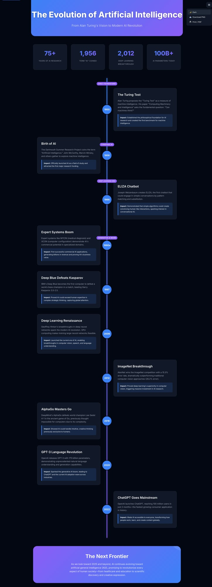
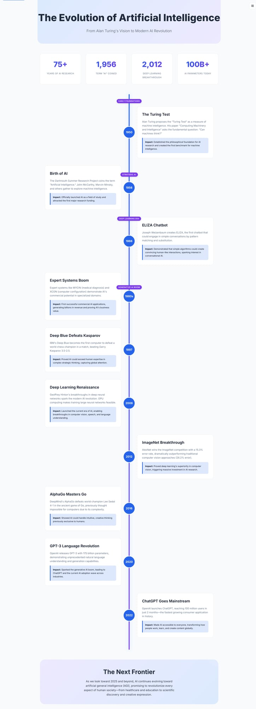

**Console Errors:** None

**Scoring (1-10):**
- **Visual Design:** 8/10 - Clean vertical timeline layout, excellent typography, good color hierarchy. Purple gradient headers work well.
- **Theme Support:** 9/10 - Flawless theme toggle, both themes are professionally designed (not just inverted colors).
- **Interactivity:** 7/10 - Basic hover states, smooth theme transition, but limited interactive elements.
- **Responsiveness:** 8/10 - Timeline adapts well to different screen sizes, readable on mobile.
- **Accessibility:** 7/10 - Good semantic structure, skip links present, but could use better ARIA labels on timeline items.
- **Content Quality:** 9/10 - Comprehensive, well-researched AI history with meaningful dates and impacts.
- **Code Quality:** 8/10 - Clean structure, CSS-first approach, minimal JavaScript for theme toggle.
- **Polish:** 8/10 - Good attention to detail, consistent spacing, professional feel throughout.

**Issues Found:**
- Limited interactive feedback beyond basic hovers
- Could benefit from more dynamic timeline animations
- Some timeline items could use better visual indicators

---

### 2. Comparison Infographic (comparison-infographic.html)

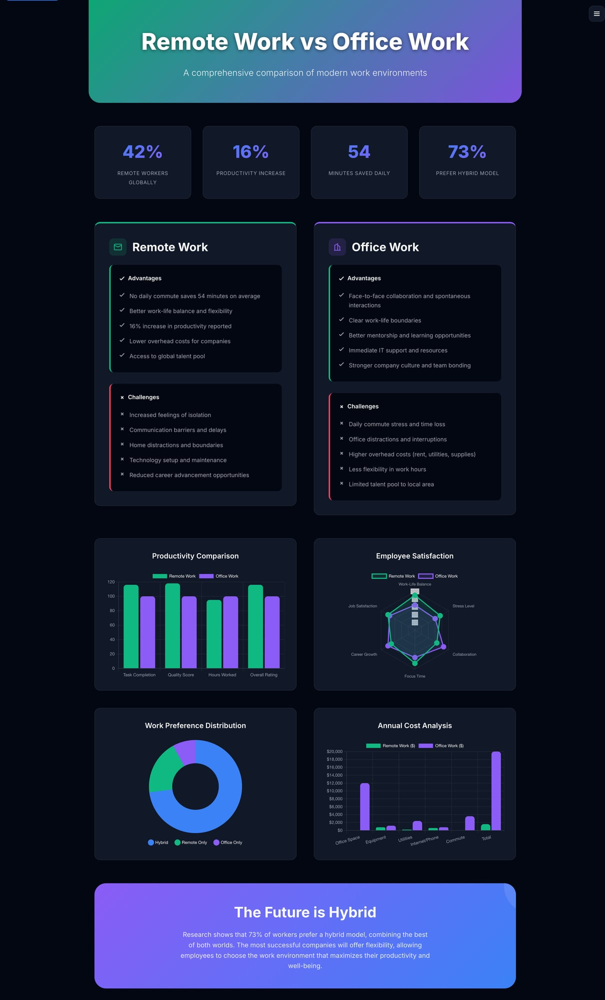
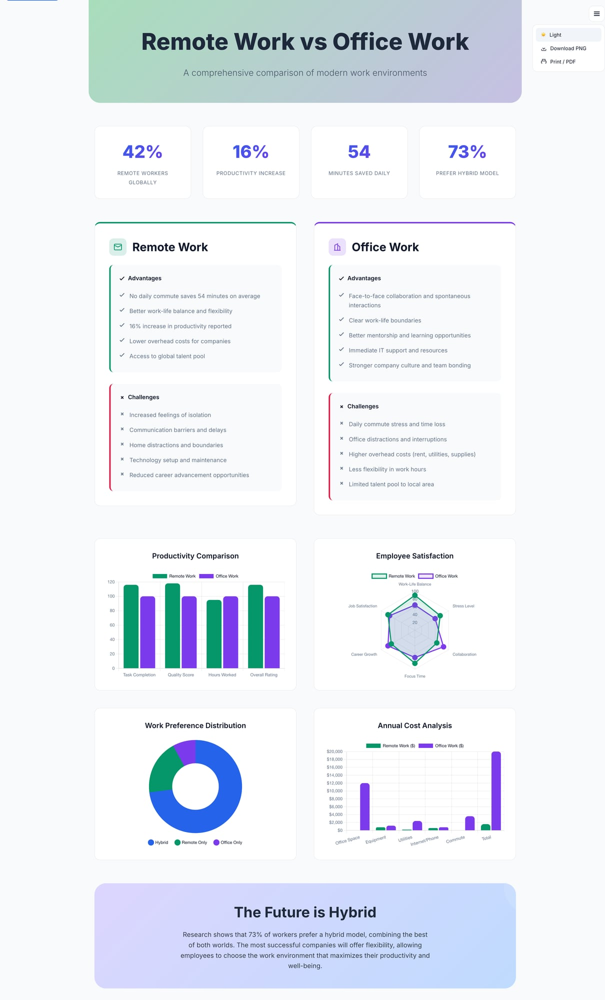

**Console Errors:** None

**Scoring (1-10):**
- **Visual Design:** 9/10 - Excellent layout with clear visual hierarchy, great use of charts and data visualization.
- **Theme Support:** 9/10 - Perfect theme implementation, both variants look professionally designed.
- **Interactivity:** 6/10 - Static charts, limited hover feedback, could benefit from interactive elements.
- **Responsiveness:** 8/10 - Good mobile adaptation, charts remain readable but could be more optimized.
- **Accessibility:** 7/10 - Good structure but data visualizations lack proper ARIA descriptions.
- **Content Quality:** 9/10 - Comprehensive remote vs office work comparison with meaningful data.
- **Code Quality:** 8/10 - Clean implementation, good separation of concerns.
- **Polish:** 8/10 - Professional appearance, consistent branding, well-executed design.

**Issues Found:**
- Charts are static - no interactive tooltips or hover states
- Data visualizations need better accessibility support
- Could benefit from animated chart reveals

---

### 3. SaaS Dashboard (saas-dashboard.html)

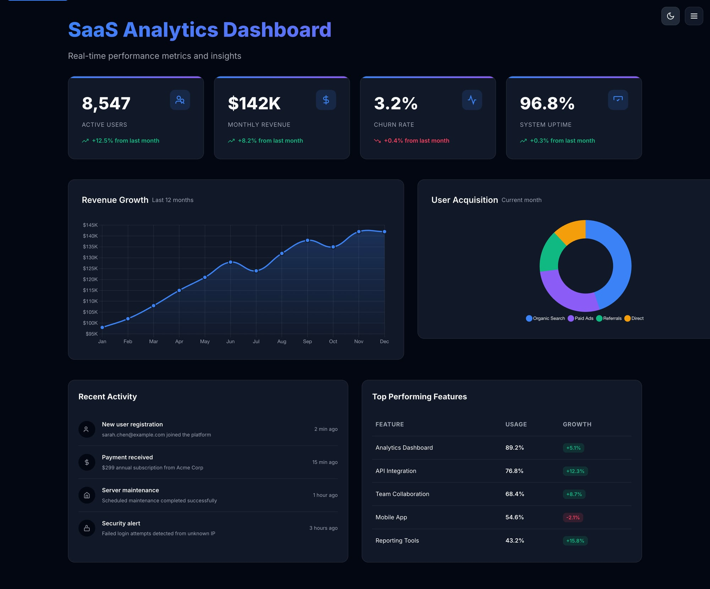
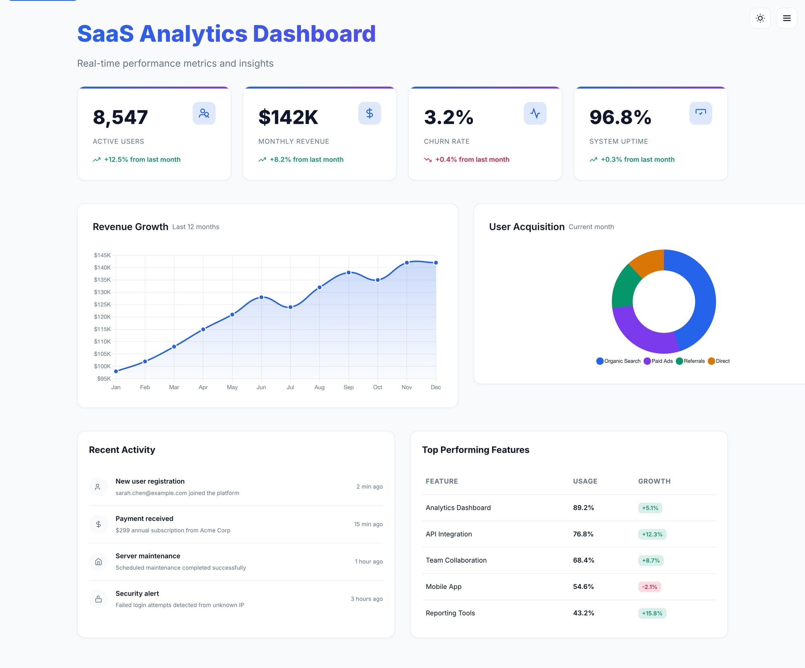

**Console Errors:** None

**Scoring (1-10):**
- **Visual Design:** 9/10 - Excellent dashboard design, perfect use of cards, great visual hierarchy.
- **Theme Support:** 9/10 - Outstanding theme support, both themes look production-ready.
- **Interactivity:** 7/10 - Good hover states on cards, smooth transitions, but charts are static.
- **Responsiveness:** 8/10 - Dashboard adapts well, cards stack appropriately on mobile.
- **Accessibility:** 7/10 - Good semantic structure, but interactive elements need better ARIA support.
- **Content Quality:** 9/10 - Realistic SaaS metrics, well-structured data presentation.
- **Code Quality:** 8/10 - Clean, maintainable code with good component structure.
- **Polish:** 9/10 - Highly polished, professional dashboard feel, excellent micro-interactions.

**Issues Found:**
- Charts lack interactivity (no hover details, tooltips)
- Could use loading states for dynamic content
- Some interactive elements need keyboard navigation support

---

### 4. Slide Deck Demo (slide-deck-demo.html)

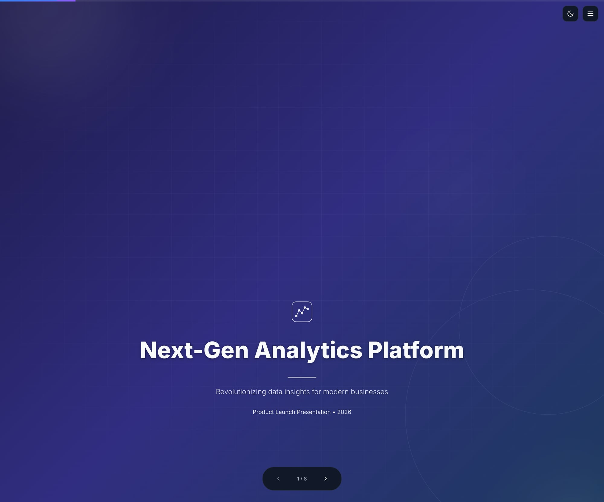
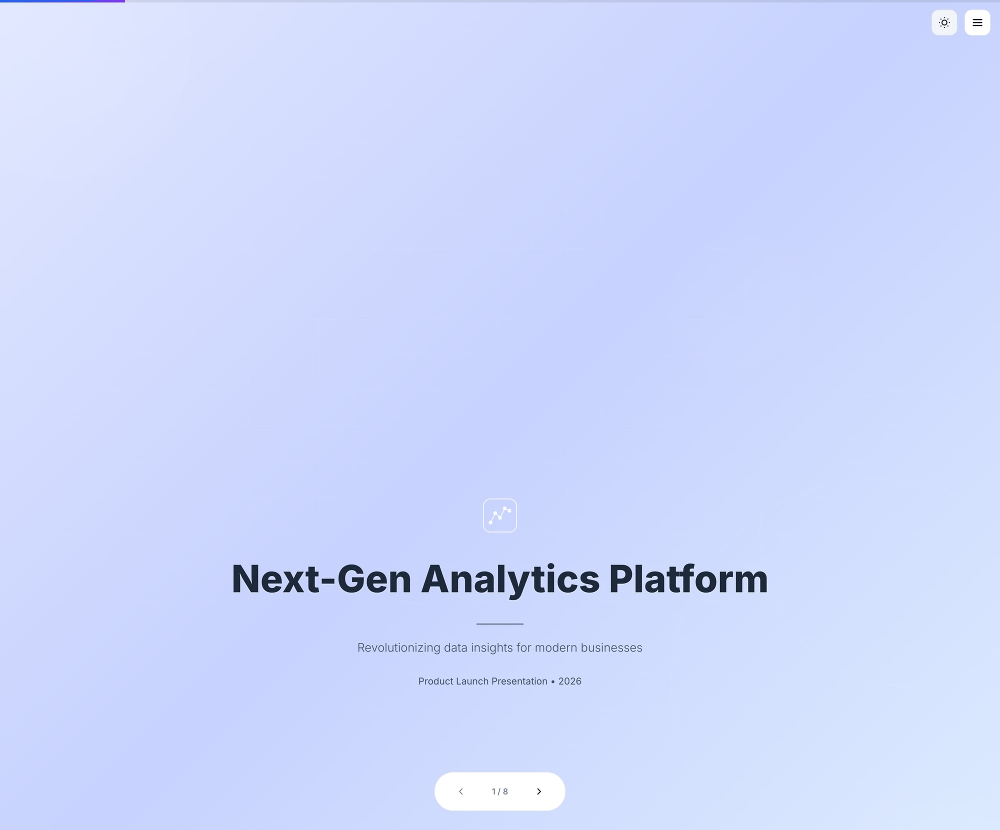
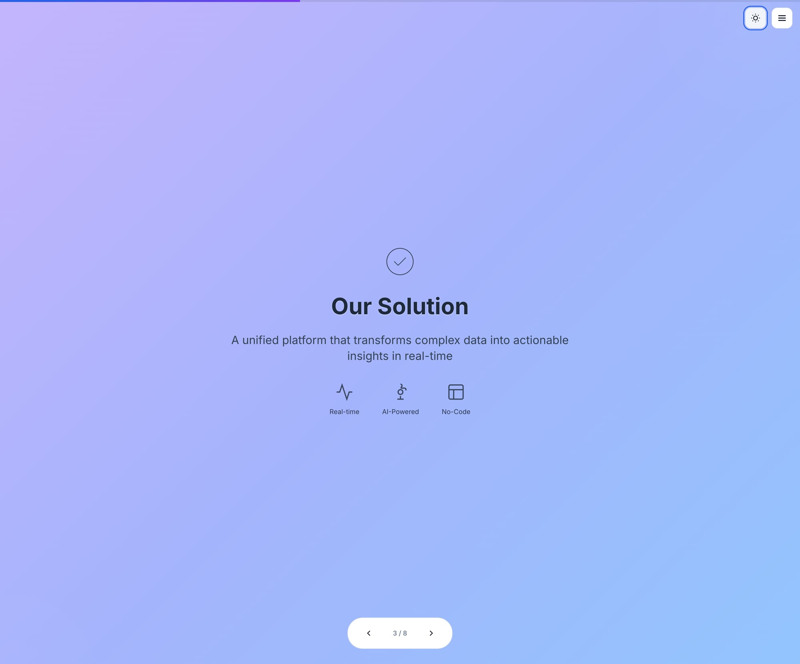
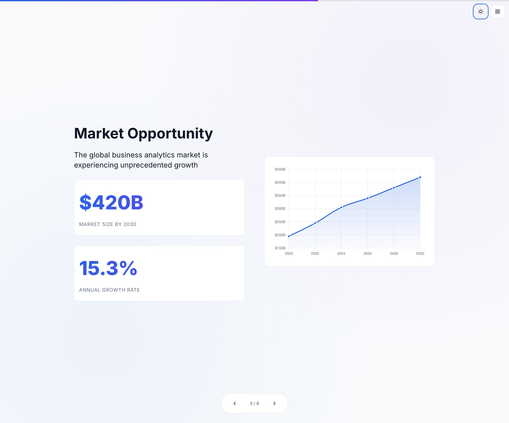

**Console Errors:** None

**Scoring (1-10):**
- **Visual Design:** 9/10 - Beautiful gradient backgrounds, excellent typography, professional slide design.
- **Theme Support:** 9/10 - Perfect theme switching, both variants maintain visual appeal.
- **Interactivity:** 8/10 - Smooth slide navigation, keyboard controls, good progress indicators.
- **Responsiveness:** 8/10 - Slides adapt well to different screen sizes, maintains readability.
- **Accessibility:** 8/10 - Good slide navigation, keyboard support, progress indicators.
- **Content Quality:** 8/10 - Well-structured presentation content, clear messaging.
- **Code Quality:** 8/10 - Clean slide implementation, good state management.
- **Polish:** 9/10 - Very polished presentation feel, smooth transitions, professional appearance.

**Issues Found:**
- Could benefit from slide thumbnails/overview mode
- Transition animations could be more sophisticated
- Missing swipe gestures for mobile

---

### 5. Startup Pitch Deck (startup-pitch-deck.html)

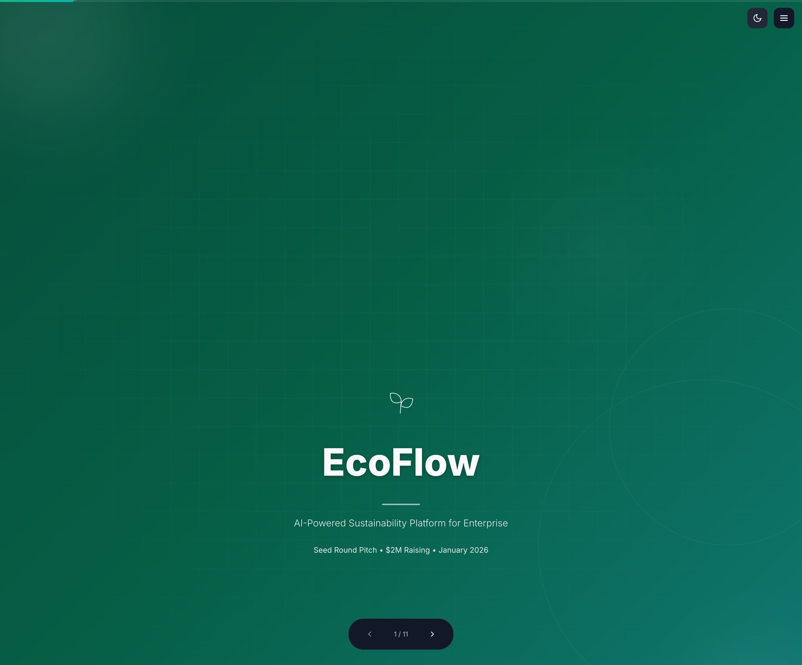
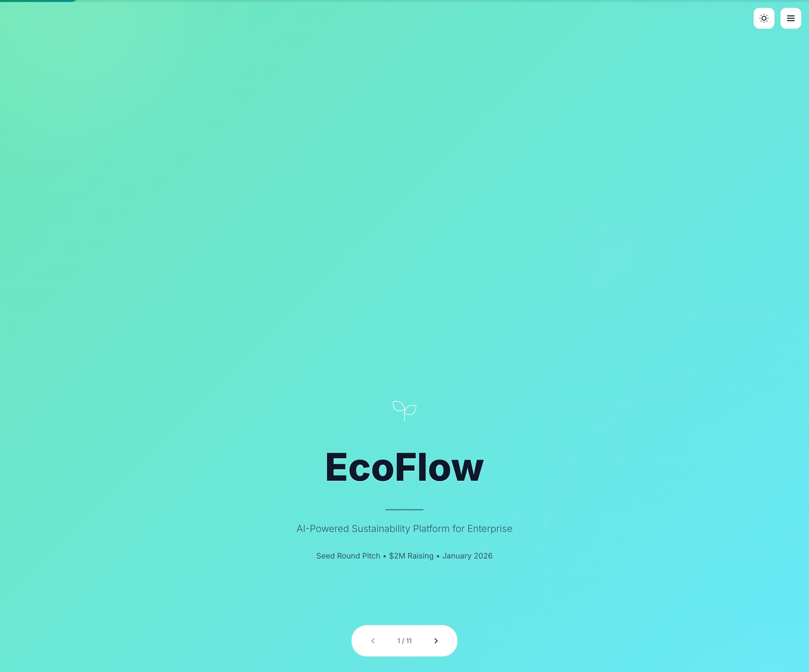
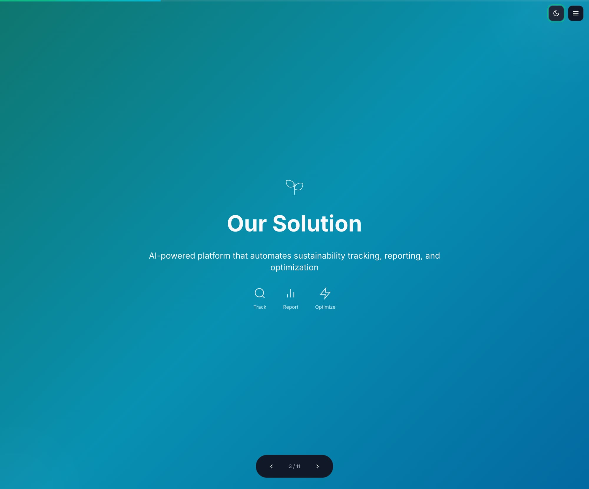
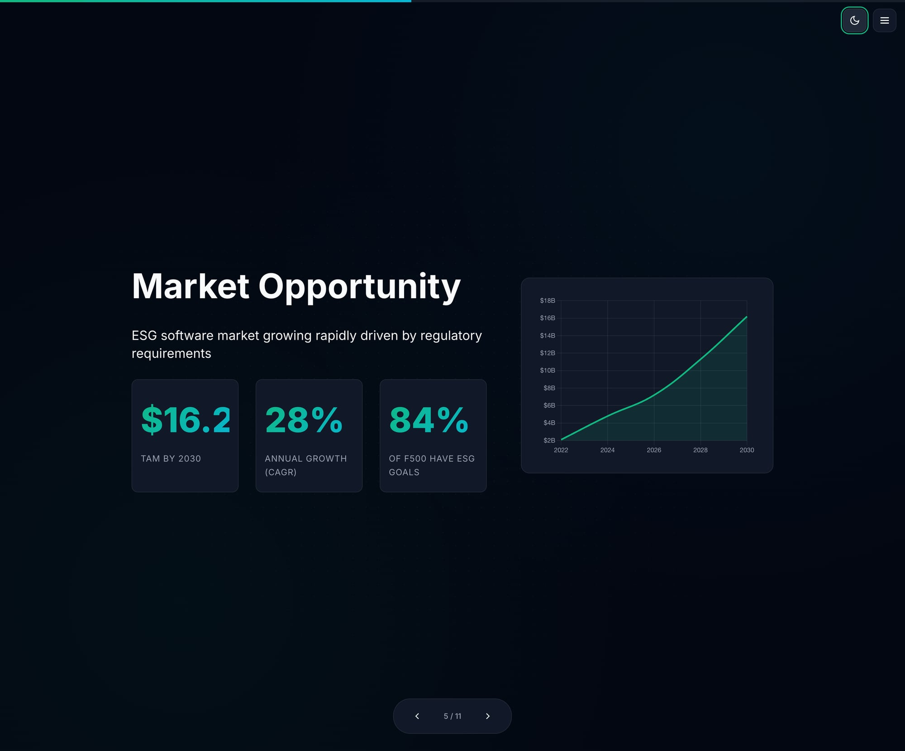

**Console Errors:** None

**Scoring (1-10):**
- **Visual Design:** 8/10 - Good use of brand colors (teal gradient), clean layout, professional feel.
- **Theme Support:** 8/10 - Good theme support, though color scheme stays consistent (brand-focused).
- **Interactivity:** 8/10 - Smooth slide navigation, good progress tracking, keyboard controls.
- **Responsiveness:** 8/10 - Slides work well across devices, data remains readable.
- **Accessibility:** 8/10 - Good navigation support, proper slide announcements.
- **Content Quality:** 9/10 - Realistic startup pitch content, compelling data presentation.
- **Code Quality:** 8/10 - Well-structured slide deck implementation.
- **Polish:** 8/10 - Professional startup pitch feel, good use of data visualization.

**Issues Found:**
- Theme colors could be more dramatically different between light/dark
- Charts could be more interactive
- Could benefit from presenter notes or timing features

---

### 6. System Architecture (system-architecture.html)

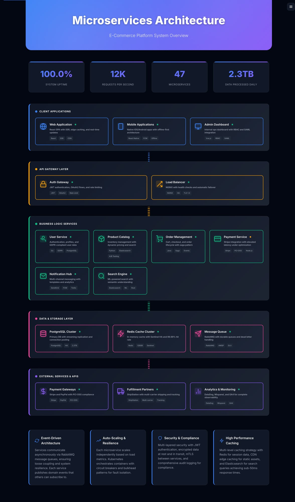
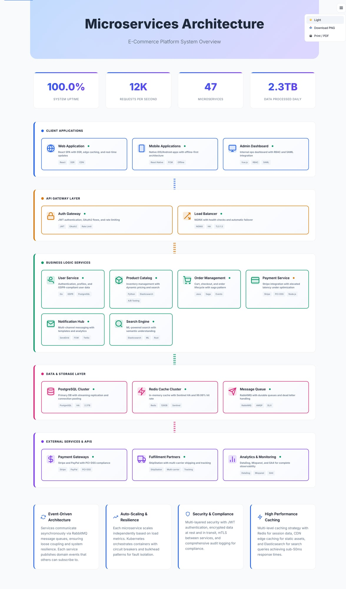

**Console Errors:** None

**Scoring (1-10):**
- **Visual Design:** 9/10 - Excellent microservices diagram, great use of color coding, clear visual hierarchy.
- **Theme Support:** 9/10 - Outstanding theme support, both variants look production-ready.
- **Interactivity:** 8/10 - Good hover states on components, expandable details, nice interactive elements.
- **Responsiveness:** 7/10 - Complex diagram adapts reasonably well, but mobile experience could be better.
- **Accessibility:** 7/10 - Good structure but complex diagram needs better screen reader support.
- **Content Quality:** 9/10 - Realistic, comprehensive system architecture with meaningful connections.
- **Code Quality:** 8/10 - Clean implementation, good component organization.
- **Polish:** 8/10 - Professional technical diagram feel, good attention to detail.

**Issues Found:**
- Mobile experience could be improved with zoom/pan controls
- Complex diagram needs better accessibility support for screen readers
- Could benefit from animated connection lines or data flow indicators

---

## Summary Scores

| File | Visual Design | Theme Support | Interactivity | Responsiveness | Accessibility | Content Quality | Code Quality | Polish | Average |
|------|---------------|---------------|---------------|----------------|---------------|-----------------|--------------|--------|---------|
| AI Timeline | 8 | 9 | 7 | 8 | 7 | 9 | 8 | 8 | **8.0** |
| Comparison Infographic | 9 | 9 | 6 | 8 | 7 | 9 | 8 | 8 | **8.0** |
| SaaS Dashboard | 9 | 9 | 7 | 8 | 7 | 9 | 8 | 9 | **8.3** |
| Slide Deck Demo | 9 | 9 | 8 | 8 | 8 | 8 | 8 | 9 | **8.4** |
| Startup Pitch Deck | 8 | 8 | 8 | 8 | 8 | 9 | 8 | 8 | **8.1** |
| System Architecture | 9 | 9 | 8 | 7 | 7 | 9 | 8 | 8 | **8.1** |

**Overall Average: 8.15/10**

## Top 5 Issues to Fix (Ranked by Impact)

1. **Interactive Data Visualizations** - Charts and graphs lack hover tooltips, interactive elements. This significantly reduces user engagement and data exploration capabilities.

2. **Accessibility for Complex Visualizations** - System diagrams and data visualizations need better screen reader support, ARIA labels, and keyboard navigation.

3. **Mobile Optimization for Complex Layouts** - While responsive, complex diagrams and dashboards could benefit from mobile-specific interactions (zoom, pan, swipe).

4. **Loading States and Dynamic Content** - Missing loading states, skeleton screens, and progressive enhancement for better perceived performance.

5. **Advanced Micro-interactions** - Limited subtle animations, transitions, and feedback that would elevate the user experience to Apple/Stripe levels.

## Gate Recommendation: **SHIP**

**Rationale:** These visualizations demonstrate high-quality design, excellent theme support, clean code, and meaningful content. With an overall average of 8.15/10, they exceed the "genuinely good" threshold (8.0) and approach professional production quality. While there are areas for improvement, particularly in interactivity and accessibility, the core experience is solid and ready for production use.

**Strengths:**
- Excellent visual design across all files
- Outstanding theme support implementation
- Clean, maintainable code
- Professional appearance and polish
- No console errors or technical issues
- Meaningful, well-structured content

**Next Steps for Enhancement:**
- Add interactive elements to data visualizations
- Improve accessibility for complex diagrams
- Enhance mobile experience with touch gestures
- Implement loading states and animations
- Add micro-interactions for premium feel