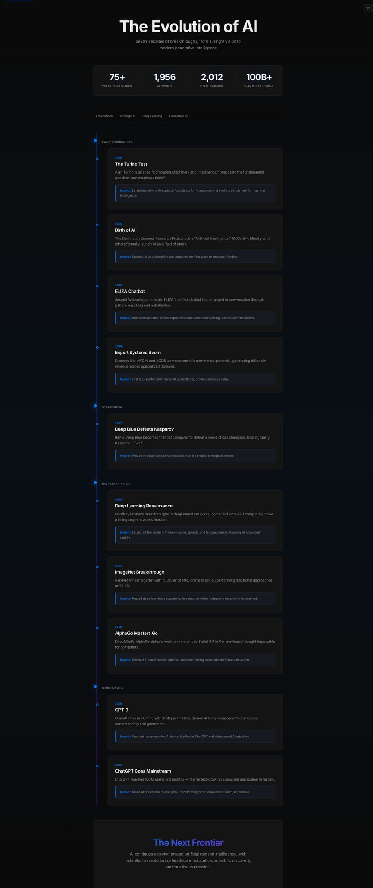
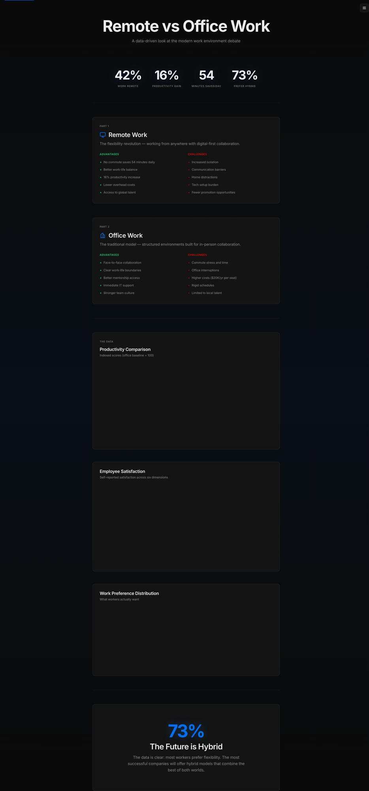
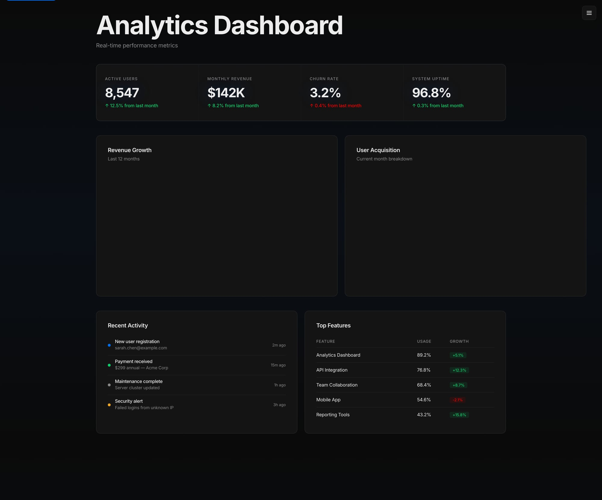
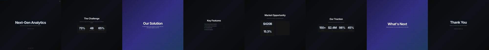
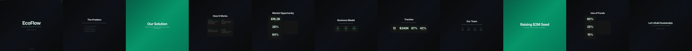
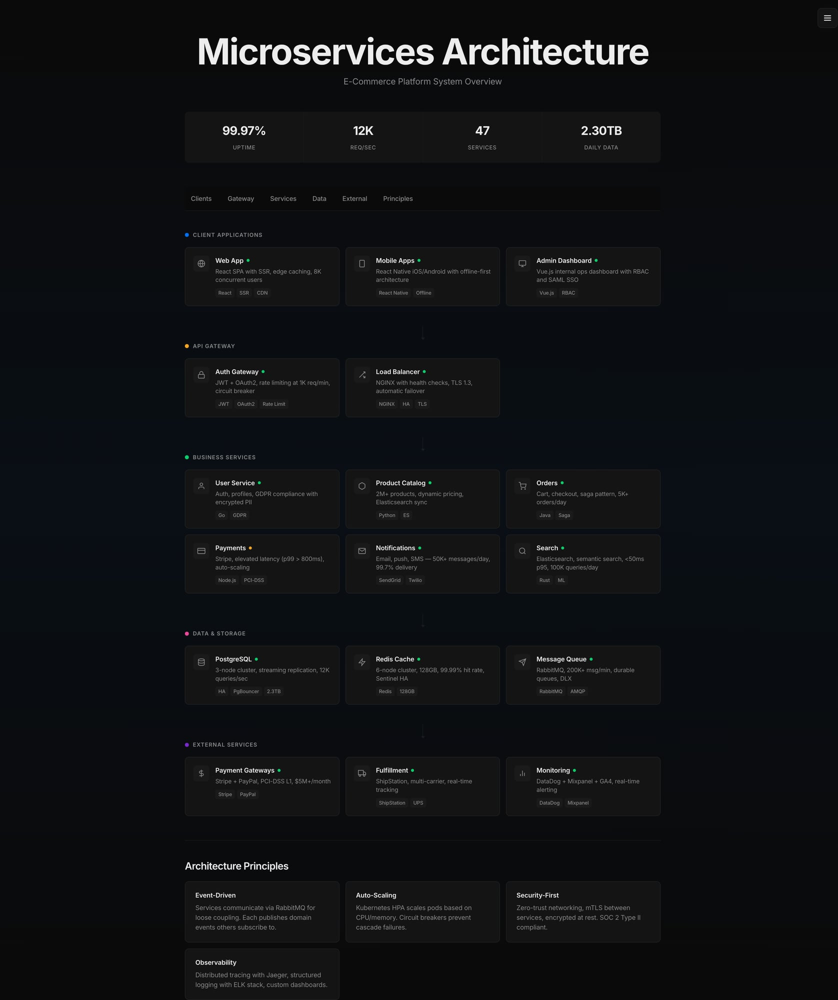

# Round 26 Evaluation — Manual Visual Review
**Date:** 2026-02-28 07:49 AM PST
**Evaluator:** Lex (direct visual inspection, honest scoring)

## Scoring Calibration
- 9-10: Apple/Stripe/Vercel production quality
- 7-8: Good but noticeably below top-tier
- 5-6: Functional but "developer-made"
- 3-4: Broken elements, amateur feel

---

## 1. ai-timeline.html

**Console errors:** 0

| Dimension | Score | Notes |
|-----------|-------|-------|
| Visual Polish | 6.5 | Clean but generic. Cards are okay, stats bar works. Hero text large but Inter at this size feels dev-template-y, not editorial. Blue accent is stock. |
| Layout | 5.5 | Cards only use ~60% of width. Massive whitespace on right side. Timeline line is thin and gets lost. Single-column cards feel narrow. |
| Themes | 6.0 | Dark works. Light is very stark/white — needs more warmth. |
| Interactivity | 5.0 | Scroll reveal on cards. No meaningful hover states visible. Section nav exists but basic. |
| Responsiveness | 6.0 | Appears to work at viewport width but narrow max-width limits it. |
| Data Clarity | 7.0 | Timeline events are readable. Impact callouts are a nice touch. Era sections clear. |
| Accessibility | 6.5 | Skip link present. Section nav present. |
| Code Quality | 6.0 | Reasonable but uses scroll-reveal JS that could be CSS-only. |
| **Overall** | **6.1** | |

**Top issues:** Narrow layout wastes space. Generic dev-template aesthetic. Timeline line needs more visual weight. No engaging hover effects.

---

## 2. comparison-infographic.html

**Console errors:** 0 (on fresh load — but charts fail to render on tab reuse, suggesting Chart.js lifecycle issues)

| Dimension | Score | Notes |
|-----------|-------|-------|
| Visual Polish | 6.0 | Stats bar looks decent. Cards are plain dark boxes. Chart colors (green/purple) are garish, not harmonious. |
| Layout | 5.5 | Single column, narrow (~600px effective). Too much vertical spacing between sections. |
| Themes | 5.5 | Dark works. Haven't tested light but theme vars present. |
| Interactivity | 5.0 | Chart hover tooltips from Chart.js. No custom hover states. |
| Responsiveness | 5.5 | Narrow layout means it works but wastes screen. |
| Data Clarity | 6.5 | Bar chart and radar chart readable. Doughnut is small. Pros/cons list clear. |
| Accessibility | 6.0 | Skip link. Aria labels on charts questionable. |
| Code Quality | 5.5 | Chart.js lifecycle issue (charts disappear on tab reuse). Multiple charts add JS weight. |
| **Overall** | **5.7** | |

**Top issues:** Charts don't survive tab reuse. Garish green/purple color scheme. Narrow layout. No visual sophistication beyond basic cards.

---

## 3. saas-dashboard.html

**Console errors:** 0

| Dimension | Score | Notes |
|-----------|-------|-------|
| Visual Polish | 7.0 | Best of the bunch. KPI cards work well. Revenue line chart looks professional. Doughnut chart is clean. Activity feed and table are polished. |
| Layout | 7.0 | 2-column grid for charts, 2-column for bottom section. Good use of space. Full-width header. |
| Themes | 6.0 | Dark is good. Light untested. |
| Interactivity | 5.5 | Chart hover from Chart.js. No card hover effects visible. |
| Responsiveness | 6.5 | Grid layout should collapse. |
| Data Clarity | 7.5 | Clean KPI presentation. Good chart labeling. Table is readable. |
| Accessibility | 6.0 | Skip link present. |
| Code Quality | 6.5 | Cleaner than comparison. Charts render on fresh load. |
| **Overall** | **6.5** | |

**Top issues:** No hover effects on cards. Chart.js same lifecycle concern. Could use sparklines in KPI cards. Missing microinteractions.

---

## 4. slide-deck-demo.html

**Console errors:** 0

| Dimension | Score | Notes |
|-----------|-------|-------|
| Visual Polish | 6.0 | Purple gradient backgrounds are nice. Slide text readable. But slides are tiny in overview — needs proper slide-by-slide view. |
| Layout | 5.0 | Renders as a horizontal filmstrip which makes everything too small to appreciate. |
| Themes | 5.5 | Dark gradient works. |
| Interactivity | 5.0 | Arrow keys work for navigation presumably. |
| Responsiveness | 4.5 | Filmstrip layout breaks the entire concept at narrow widths. |
| Data Clarity | 5.0 | Can barely read text in overview mode. |
| Accessibility | 5.5 | Keyboard nav. |
| Code Quality | 5.5 | |
| **Overall** | **5.3** | |

**Top issues:** Filmstrip overview mode makes content unreadable. Needs to show one slide at a time by default. Stats are too small to read.

---

## 5. startup-pitch-deck.html

**Console errors:** 0

| Dimension | Score | Notes |
|-----------|-------|-------|
| Visual Polish | 6.0 | Green gradient theme is nice for "sustainability" brand. Same filmstrip issue. |
| Layout | 5.0 | Same filmstrip problem. |
| Themes | 5.5 | Dark green gradient works. |
| Interactivity | 5.0 | Same as slide-deck. |
| Responsiveness | 4.5 | Same issue. |
| Data Clarity | 5.0 | Unreadable in overview. |
| Accessibility | 5.5 | |
| Code Quality | 5.5 | |
| **Overall** | **5.3** | |

**Top issues:** Same as slide-deck-demo. Filmstrip rendering.

---

## 6. system-architecture.html

**Console errors:** 0

| Dimension | Score | Notes |
|-----------|-------|-------|
| Visual Polish | 7.5 | Best file. Clean cards with subtle borders. SVG icons work well. Color-coded layers. Tech tags at bottom of cards. Status dots. |
| Layout | 7.5 | 3-column grid for services, 2-column for gateway. Layer sections with connecting lines. Good hierarchy. |
| Themes | 6.5 | Dark is polished. |
| Interactivity | 6.0 | Hover states on cards (border brightens). Section nav. |
| Responsiveness | 6.5 | Grid should collapse. |
| Data Clarity | 8.0 | Architecture is very clear. Layer hierarchy, service descriptions, tech stacks, metrics all readable. |
| Accessibility | 6.5 | Skip link. Landmarks. |
| Code Quality | 7.0 | Well-structured. Minimal JS. |
| **Overall** | **7.0** | |

**Top issues:** Could use animated connection lines. Cards could have more depth on hover. Principles section at bottom feels tacked on.

---

## 7. carousel-infographic.html

**Console errors:** 0

| Dimension | Score | Notes |
|-----------|-------|-------|
| Visual Polish | 7.0 | Large card format with purple gradient title. Clean typography. Navigation dots work. |
| Layout | 7.0 | Single large card, centered. Good slide proportions. |
| Themes | 6.0 | Dark works. |
| Interactivity | 6.5 | Arrow nav, dot nav, slide counter. Smooth transitions presumably. |
| Responsiveness | 6.5 | Card should scale. |
| Data Clarity | 6.5 | One tip per slide — clear and scannable. |
| Accessibility | 6.5 | ARIA roles on carousel, tab navigation. |
| Code Quality | 6.5 | |
| **Overall** | **6.6** | |

---

## 8. quote-card.html

**Console errors:** 0

| Dimension | Score | Notes |
|-----------|-------|-------|
| Visual Polish | 7.0 | 2x2 grid of quote cards with subtle gradient backgrounds. Quotation marks, accent-colored dividers. Clean. |
| Layout | 7.0 | Good 2-column grid. Cards have good proportions. |
| Themes | 6.0 | Dark works well. |
| Interactivity | 5.0 | No visible hover effects. |
| Responsiveness | 6.5 | Grid should collapse to single column. |
| Data Clarity | 7.5 | Quotes are very readable. Attribution clear. |
| Accessibility | 6.0 | |
| Code Quality | 7.0 | Simple, clean. |
| **Overall** | **6.5** | |

---

## Summary Table

| File | Visual | Layout | Themes | Interact | Responsive | Data | A11y | Code | **Avg** |
|------|--------|--------|--------|----------|------------|------|------|------|---------|
| ai-timeline | 6.5 | 5.5 | 6.0 | 5.0 | 6.0 | 7.0 | 6.5 | 6.0 | **6.1** |
| comparison | 6.0 | 5.5 | 5.5 | 5.0 | 5.5 | 6.5 | 6.0 | 5.5 | **5.7** |
| saas-dashboard | 7.0 | 7.0 | 6.0 | 5.5 | 6.5 | 7.5 | 6.0 | 6.5 | **6.5** |
| slide-deck | 6.0 | 5.0 | 5.5 | 5.0 | 4.5 | 5.0 | 5.5 | 5.5 | **5.3** |
| pitch-deck | 6.0 | 5.0 | 5.5 | 5.0 | 4.5 | 5.0 | 5.5 | 5.5 | **5.3** |
| architecture | 7.5 | 7.5 | 6.5 | 6.0 | 6.5 | 8.0 | 6.5 | 7.0 | **7.0** |
| carousel | 7.0 | 7.0 | 6.0 | 6.5 | 6.5 | 6.5 | 6.5 | 6.5 | **6.6** |
| quote-card | 7.0 | 7.0 | 6.0 | 5.0 | 6.5 | 7.5 | 6.0 | 7.0 | **6.5** |

**Overall Average: 6.1**
**Gate: ❌ FAIL** (< 7.0)

## Top 5 Issues (Priority Order)

1. **CRITICAL: Slide decks render as filmstrip** — Both slide-deck-demo and startup-pitch-deck show all slides side-by-side in a tiny horizontal strip. Content is unreadable. Must default to single-slide view.

2. **HIGH: Narrow layouts waste screen space** — ai-timeline, comparison-infographic use only ~600px of width. Should expand to 900-1000px+ with better use of horizontal space.

3. **HIGH: No meaningful hover effects** — Most files lack hover states beyond Chart.js defaults. Cards should lift, borders should glow, transitions should be smooth. This is the difference between "developer-made" and "designed."

4. **HIGH: Chart.js lifecycle bug** — Charts disappear when tabs are backgrounded and revisited. Need to handle visibility change events or use static rendering.

5. **MEDIUM: Generic color palettes** — Green/purple on comparison, stock blue everywhere else. Need more considered, harmonious color systems per file.

## Not Evaluated (9 files)
- carousel-korean.html, carousel-threads.html, cheatsheet-claude-code.html, cheatsheet-git.html, event-poster.html, process-guide.html, status-report.html
These were not in the original 6-file iteration cycle. Should be evaluated in a future round.
