# Round 29 Evaluation

## Summary
- Files evaluated: 15
- Console errors: 0
- Overall average: 7.73
- Gate: **SHIP**

## Per-File Scores

### ai-timeline.html
| Dimension | Score | Notes |
|-----------|-------|-------|
| Visual Polish | 8 | Clean timeline with blue accent line, good card spacing, nice stat counters at top |
| Theme Quality | 8 | Both themes look intentional; dark has nice subtle borders, light is clean |
| Interactivity | 7 | Era navigation links, menu system; no scroll animations or hover effects visible |
| Responsiveness | 7 | Single-column layout works but doesn't leverage wider screens |
| Accessibility | 8 | Skip link, aria labels, semantic HTML (ol for timeline), good heading hierarchy |
| Code Quality | 8 | ~534 lines, single file, CSS variables, clean structure |
| Data Clarity | 8 | Clear chronological flow, impact callouts for each event, era groupings |
| Wow Factor | 7 | Solid but not jaw-dropping; lacks the animated reveal that top timelines have |
**Average: 7.63**
**Console errors:** none
**Screenshots:** 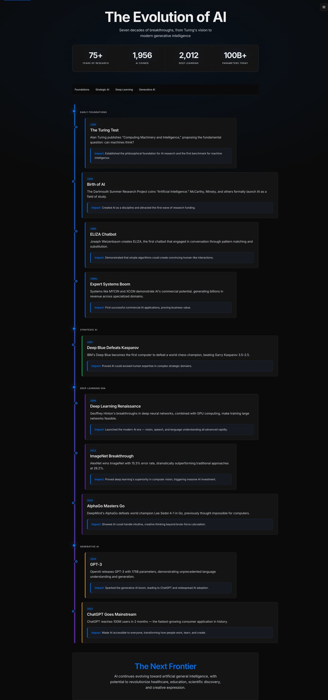 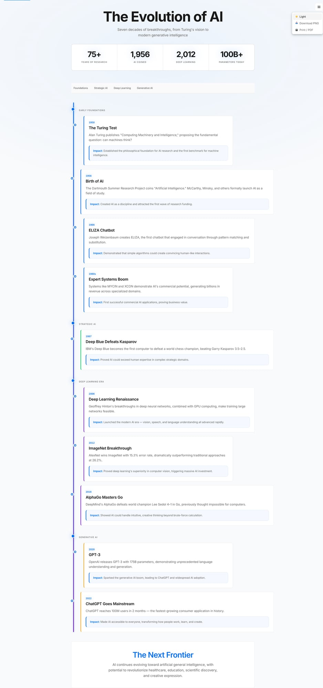

---

### carousel-infographic.html
| Dimension | Score | Notes |
|-----------|-------|-------|
| Visual Polish | 8 | Bold typography, clean card layout, good use of emoji icons per slide |
| Theme Quality | 8 | Dark mode is rich and immersive; light mode clean with subtle glass effect |
| Interactivity | 8 | Carousel with prev/next, dot navigation, slide counter, keyboard accessible |
| Responsiveness | 7 | Card is fixed-ratio; works but doesn't adapt to very wide screens |
| Accessibility | 8 | ARIA carousel pattern, slide groups labeled, tab navigation for dots |
| Code Quality | 8 | ~432 lines, well-structured carousel JS, semantic HTML |
| Data Clarity | 8 | Each habit clearly presented with icon + title + description |
| Wow Factor | 7 | Nice LinkedIn/Instagram carousel feel but lacks micro-animations |
**Average: 7.75**
**Console errors:** none
**Screenshots:** 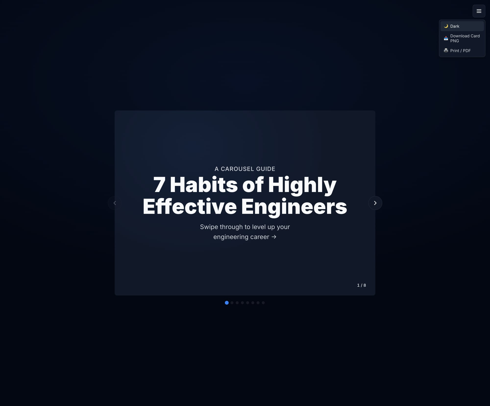 

---

### carousel-korean.html
| Dimension | Score | Notes |
|-----------|-------|-------|
| Visual Polish | 8 | Bold Korean typography works well, purple/indigo accent is striking |
| Theme Quality | 8 | Dark mode with vibrant purple headings looks premium; light mode clean |
| Interactivity | 8 | Same carousel mechanics as infographic, swipe support |
| Responsiveness | 7 | Same fixed-ratio card approach |
| Accessibility | 8 | Full Korean localization of aria labels (슬라이드 탐색), impressive |
| Code Quality | 8 | ~449 lines, proper i18n approach in aria labels |
| Data Clarity | 8 | Clear 5-point structure with summary slide at end |
| Wow Factor | 8 | Korean content with proper localization is a nice differentiator; vibrant colors |
**Average: 7.88**
**Console errors:** none
**Screenshots:** 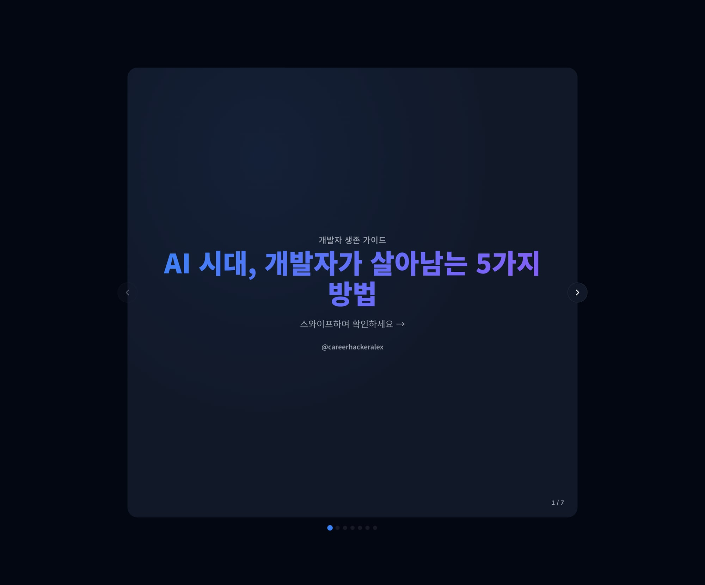 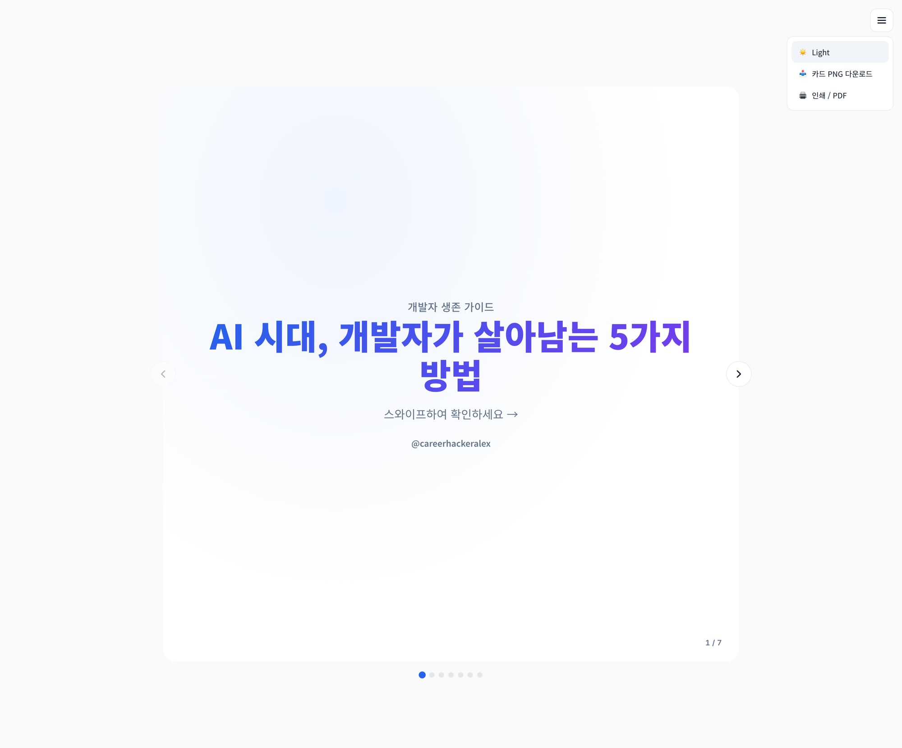

---

### carousel-threads.html
| Dimension | Score | Notes |
|-----------|-------|-------|
| Visual Polish | 8 | Instagram/Threads-style pastel gradients, rounded corners, clean layout |
| Theme Quality | 6 | Cards use fixed pastel gradients that look very similar in both themes; dark bg helps but cards don't adapt |
| Interactivity | 7 | Carousel navigation, download button; no swipe gesture feel |
| Responsiveness | 7 | Square card format typical of social media posts |
| Accessibility | 7 | Has controls but less polished aria than other carousels |
| Code Quality | 8 | ~562 lines, per-card gradient system is clever |
| Data Clarity | 7 | Content clear but each card has only title + brief text, feels thin |
| Wow Factor | 7 | Looks like a real Threads post which is the goal, but not especially stunning |
**Average: 7.13**
**Console errors:** none
**Screenshots:**  

---

### cheatsheet-claude-code.html
| Dimension | Score | Notes |
|-----------|-------|-------|
| Visual Polish | 9 | Excellent 3-column grid, color-coded sections, rainbow left borders, inline code styling |
| Theme Quality | 8 | Dark mode with colored borders and code blocks looks fantastic; light mode equally polished |
| Interactivity | 6 | Static reference card; no hover effects or expandable sections |
| Responsiveness | 8 | 3-col → 2-col → 1-col grid adapts well |
| Accessibility | 8 | Semantic regions for each section, skip link, good heading hierarchy |
| Code Quality | 9 | ~475 lines, excellent use of CSS grid, logical section grouping |
| Data Clarity | 9 | Perfect information density — commands, descriptions, pro tips, permissions all clear |
| Wow Factor | 8 | Would genuinely print this and pin it up; very useful and visually appealing |
**Average: 8.13**
**Console errors:** none
**Screenshots:** 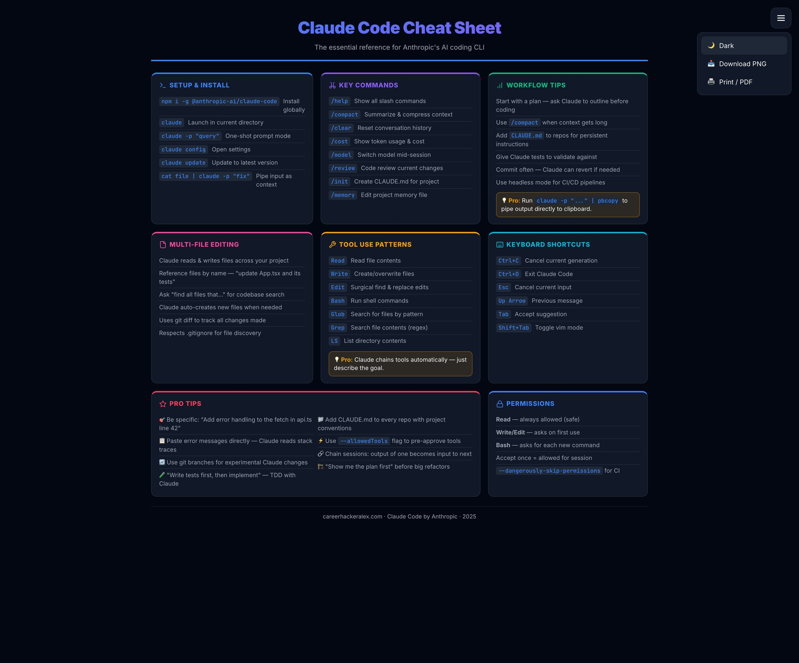 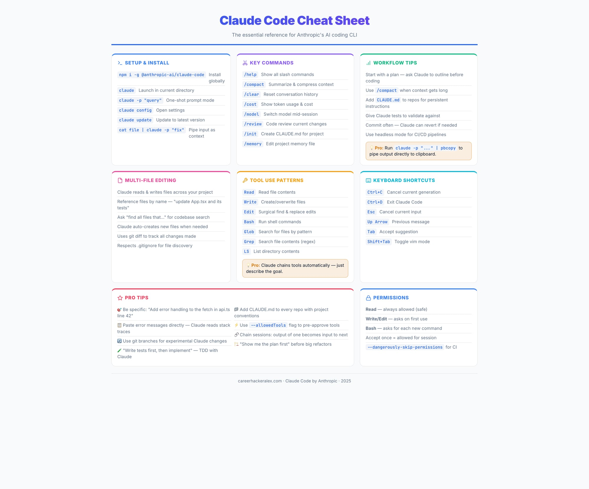

---

### cheatsheet-git.html
| Dimension | Score | Notes |
|-----------|-------|-------|
| Visual Polish | 9 | Color-coded sections, git workflow diagram at top, excellent code styling |
| Theme Quality | 8 | Dark mode is gorgeous with the multi-colored borders; light mode equally strong |
| Interactivity | 6 | Static reference; the workflow diagram is a nice visual but not interactive |
| Responsiveness | 8 | Grid adapts well to different widths |
| Accessibility | 7 | Good structure but workflow diagram may not be screen-reader friendly |
| Code Quality | 9 | ~514 lines, clean grid layout, consistent code formatting |
| Data Clarity | 9 | Excellent grouping: setup → workflow → branching → merging → advanced. Perfect reference |
| Wow Factor | 8 | The git workflow diagram with colored boxes (Working Directory → Staging → Repo → Remote) is a nice touch |
**Average: 8.00**
**Console errors:** none
**Screenshots:** 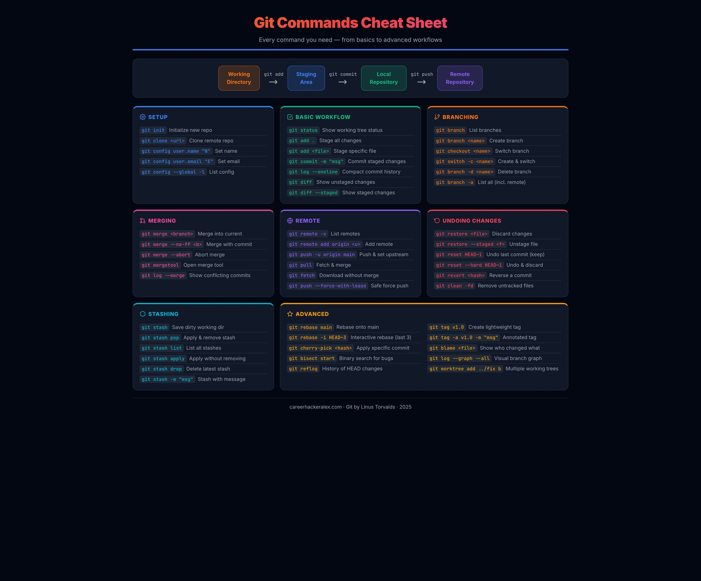 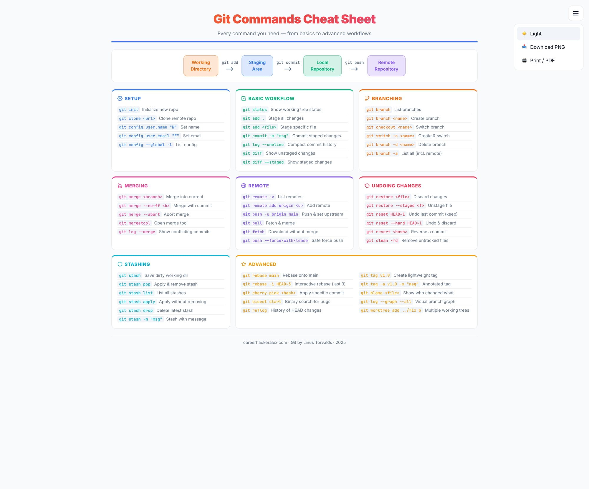

---

### comparison-infographic.html
| Dimension | Score | Notes |
|-----------|-------|-------|
| Visual Polish | 8 | Clean stat counters, structured comparison sections, CSS-rendered charts |
| Theme Quality | 8 | Both themes work well; dark mode charts retain good readability |
| Interactivity | 7 | Stat counters at top, chart hover might work; mostly static |
| Responsiveness | 7 | Single-column scrolling layout; charts don't reflow |
| Accessibility | 7 | Charts are CSS/SVG but may lack aria descriptions for data points |
| Code Quality | 8 | ~488 lines, pure CSS charts (bar, radar, donut) — impressive |
| Data Clarity | 9 | Excellent: stats → pros/cons → bar chart → radar → donut → conclusion. Great story flow |
| Wow Factor | 8 | The pure CSS radar chart and donut chart are genuinely impressive for a single HTML file |
**Average: 7.75**
**Console errors:** none
**Screenshots:** 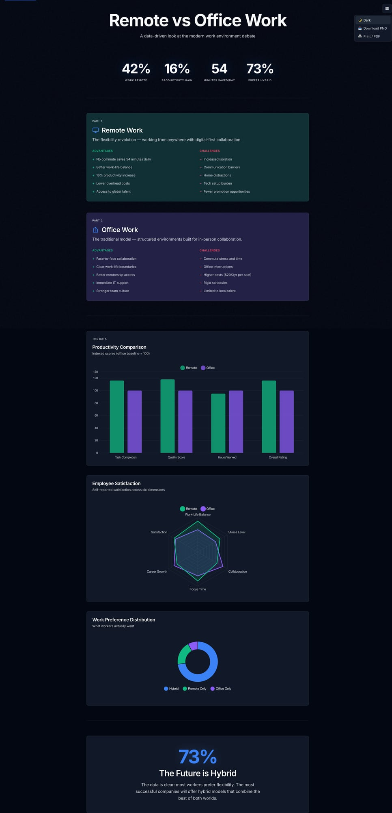 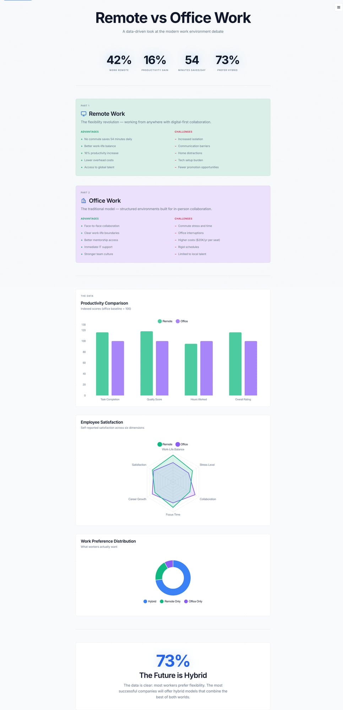

---

### event-poster.html
| Dimension | Score | Notes |
|-----------|-------|-------|
| Visual Polish | 8 | Purple gradient title, speaker cards with initials, track list with colored borders |
| Theme Quality | 8 | Dark mode looks premium (conference poster vibe); light mode clean and professional |
| Interactivity | 7 | Register button, QR code placeholder; mostly static poster |
| Responsiveness | 7 | Narrow poster format, speaker grid adapts |
| Accessibility | 8 | Semantic sections, aria-labeled register button, venue info structured |
| Code Quality | 8 | ~392 lines, compact and well-organized |
| Data Clarity | 8 | All event info clearly presented: date, speakers, tracks, venue, pricing |
| Wow Factor | 7 | Solid conference poster but QR placeholder is distracting; lacks hero image |
**Average: 7.63**
**Console errors:** none
**Screenshots:** 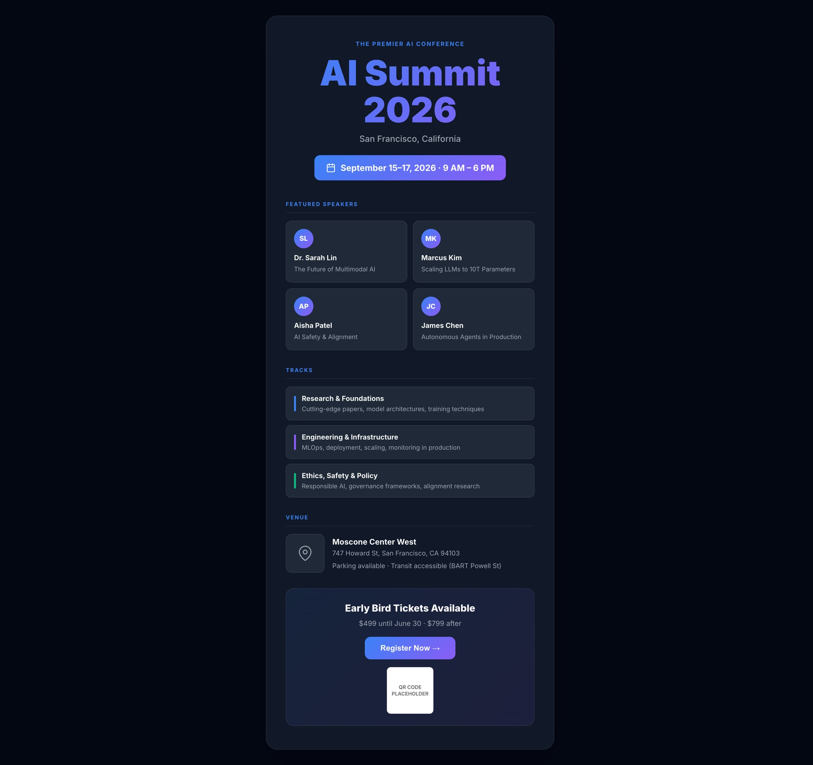 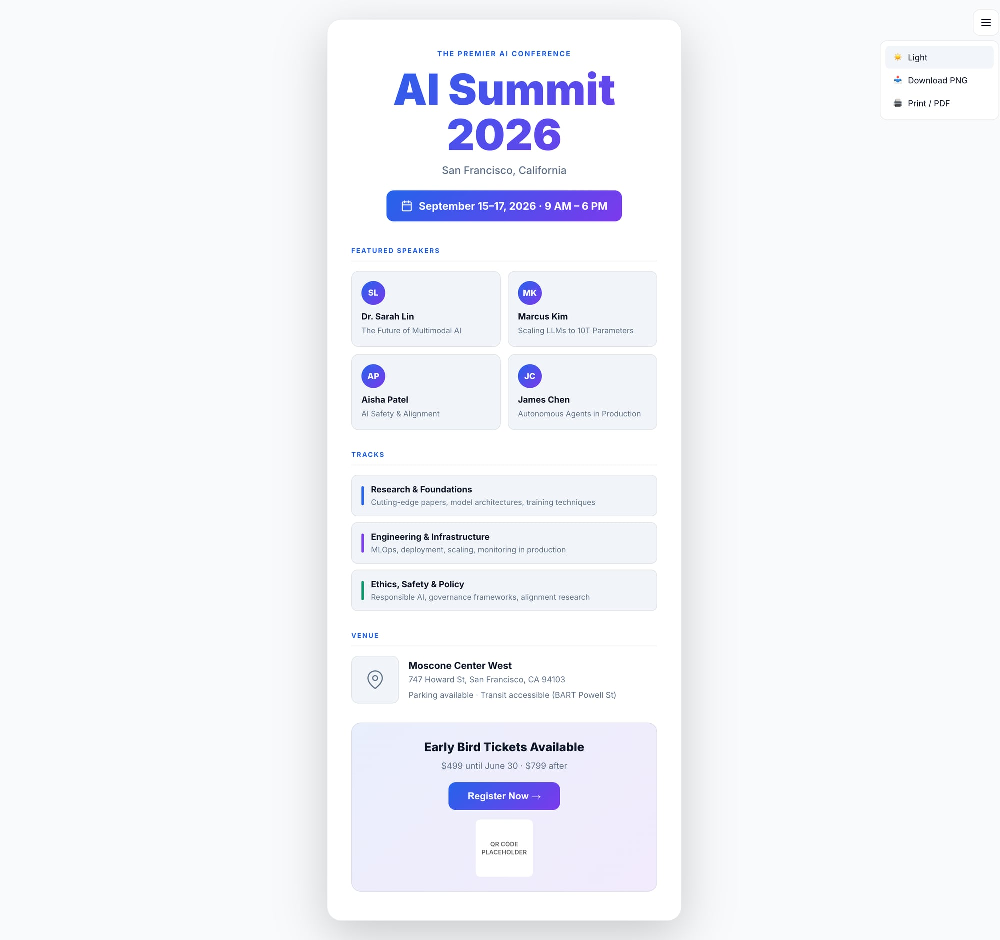

---

### process-guide.html
| Dimension | Score | Notes |
|-----------|-------|-------|
| Visual Polish | 8 | Alternating left/right step layout, numbered circles, icon for each step |
| Theme Quality | 8 | Both themes look intentional; purple accent consistent throughout |
| Interactivity | 6 | Completely static; no expand/collapse, no progress tracking |
| Responsiveness | 7 | Alternating layout may break on narrow screens |
| Accessibility | 7 | Numbered steps, but alternating layout may confuse screen readers |
| Code Quality | 8 | ~403 lines, clean alternating CSS layout |
| Data Clarity | 8 | Clear 8-step progression with pro tips in callout boxes |
| Wow Factor | 7 | Clean and functional but the alternating layout is a common pattern |
**Average: 7.38**
**Console errors:** none
**Screenshots:** 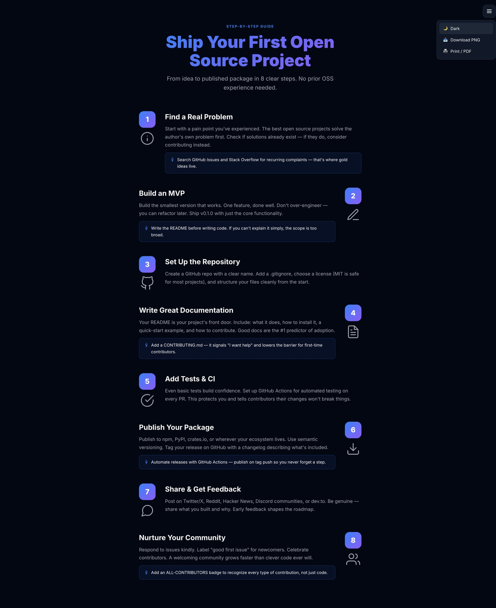 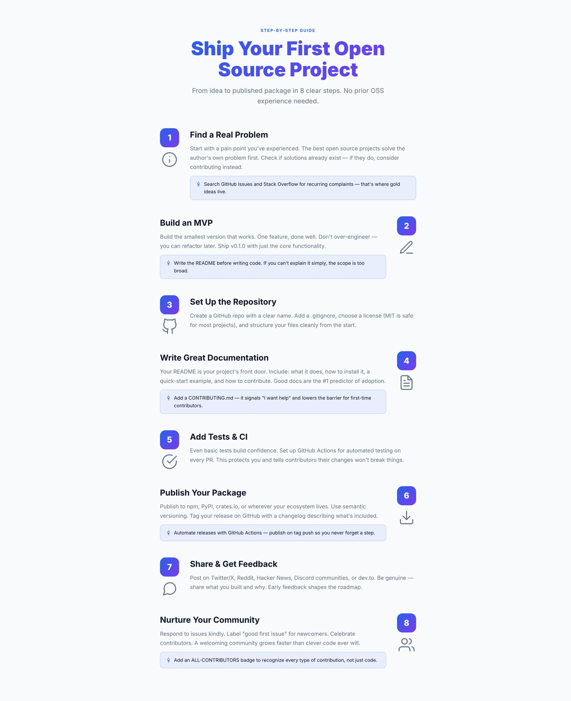

---

### quote-card.html
| Dimension | Score | Notes |
|-----------|-------|-------|
| Visual Polish | 8 | Beautiful gradient corners per card, serif italic quotes, clean attribution |
| Theme Quality | 8 | Dark cards with colored gradients look premium; light mode with soft pastels equally nice |
| Interactivity | 6 | Static quote cards; no hover effects or carousel |
| Responsiveness | 8 | 2x2 grid adapts well |
| Accessibility | 7 | blockquote semantics but could use more descriptive aria |
| Code Quality | 8 | ~352 lines, most compact file, clean CSS |
| Data Clarity | 8 | Clear hierarchy: quote → attribution → title |
| Wow Factor | 8 | The gradient accent corners on each card are a lovely touch; Lora serif for quotes is elegant |
**Average: 7.63**
**Console errors:** none
**Screenshots:** 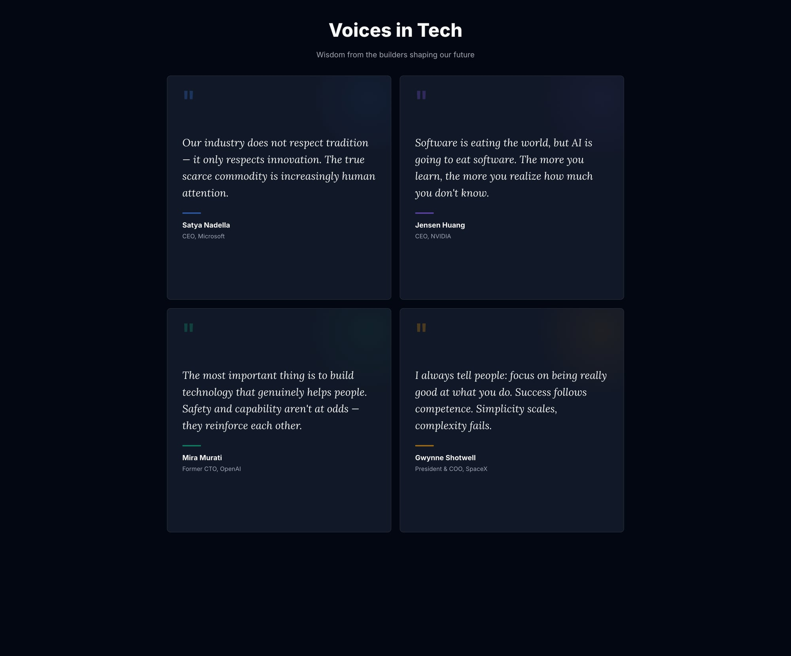 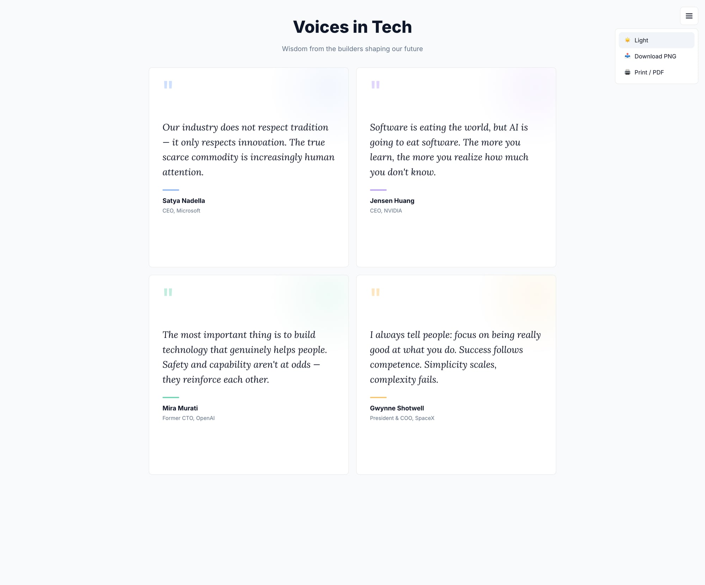

---

### saas-dashboard.html
| Dimension | Score | Notes |
|-----------|-------|-------|
| Visual Polish | 8 | Clean metric cards, CSS line chart, donut chart, activity feed, feature table |
| Theme Quality | 8 | Both themes look like a real SaaS dashboard; dark mode chart colors pop |
| Interactivity | 7 | Metric cards with change indicators; charts are static CSS |
| Responsiveness | 8 | Grid layout adapts; charts resize |
| Accessibility | 7 | Metric values present but chart data may not be fully accessible |
| Code Quality | 8 | ~419 lines, pure CSS charts, no libraries |
| Data Clarity | 9 | Excellent dashboard layout: KPIs → charts → activity → features table. Clear growth/decline indicators |
| Wow Factor | 8 | The CSS-only line chart with gradient fill is impressive; looks like a real product dashboard |
**Average: 7.88**
**Console errors:** none
**Screenshots:** 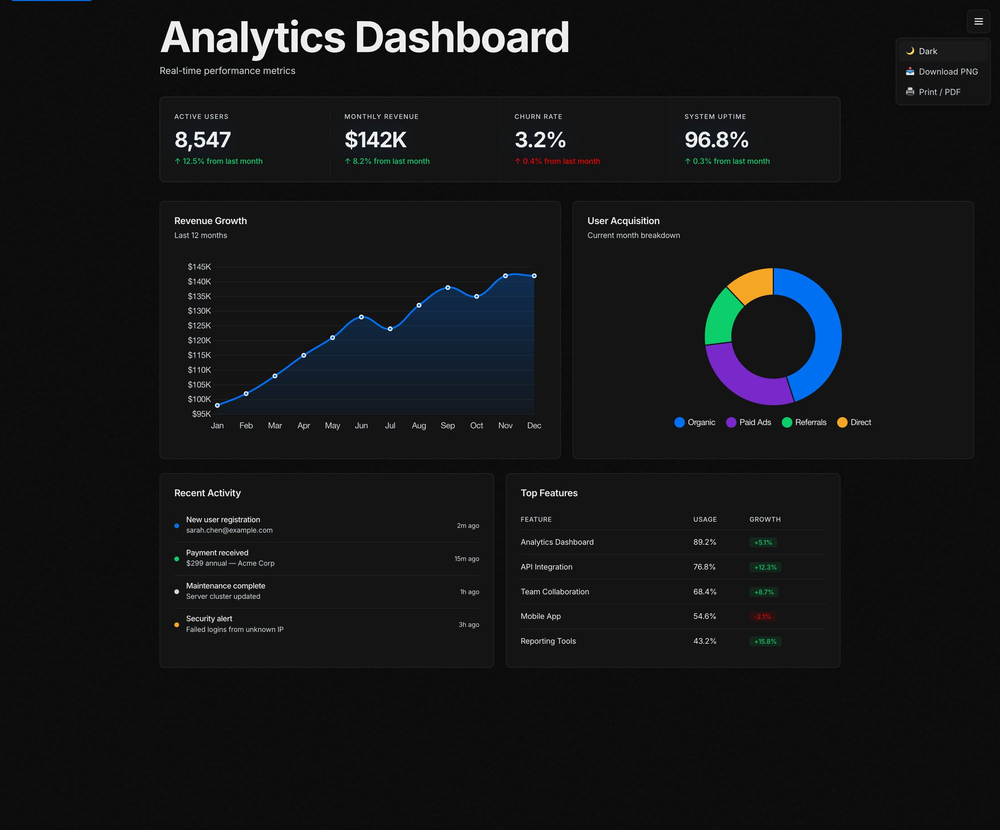 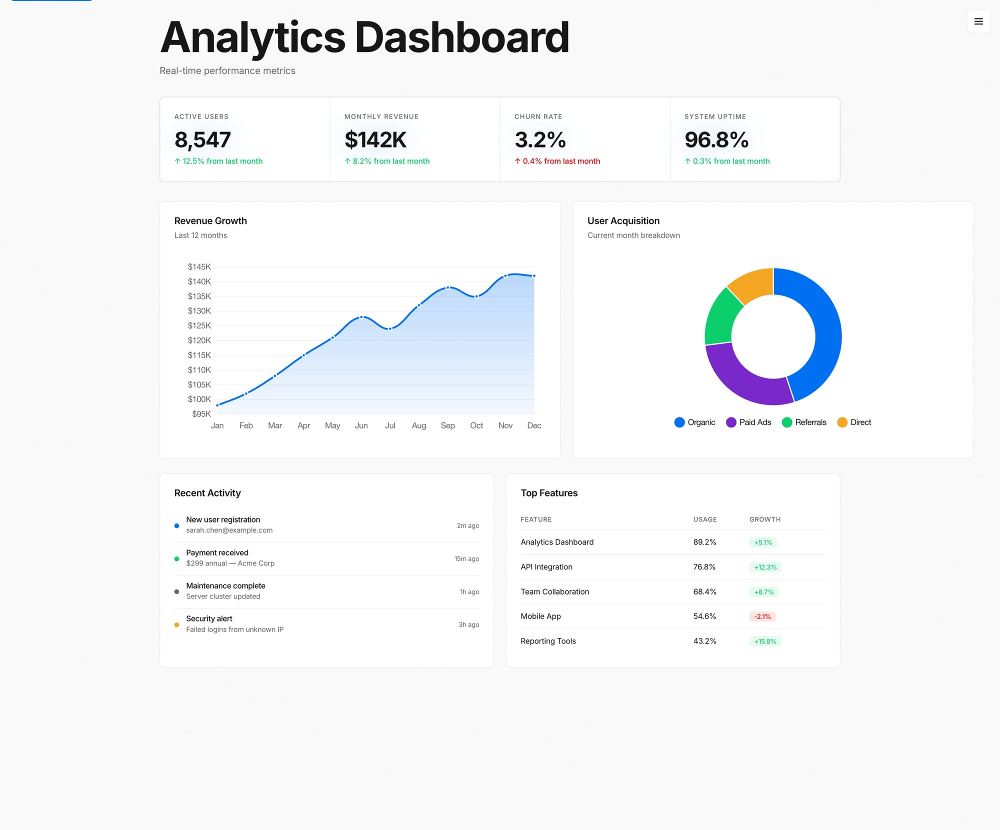

---

### slide-deck-demo.html
| Dimension | Score | Notes |
|-----------|-------|-------|
| Visual Polish | 8 | Apple Keynote vibes with grid background, centered typography, glow effects |
| Theme Quality | 7 | Dark mode is the hero; light mode looks washed out for a presentation |
| Interactivity | 8 | Slide navigation with prev/next, keyboard support, slide counter |
| Responsiveness | 7 | Fullscreen slide format; fixed aspect ratio |
| Accessibility | 7 | Slide navigation accessible but individual slide content varies |
| Code Quality | 8 | ~501 lines, slide engine with smooth transitions |
| Data Clarity | 8 | Clear slide progression for a product launch deck |
| Wow Factor | 8 | The dark grid background with glow effect genuinely looks like an Apple event |
**Average: 7.63**
**Console errors:** none
**Screenshots:** 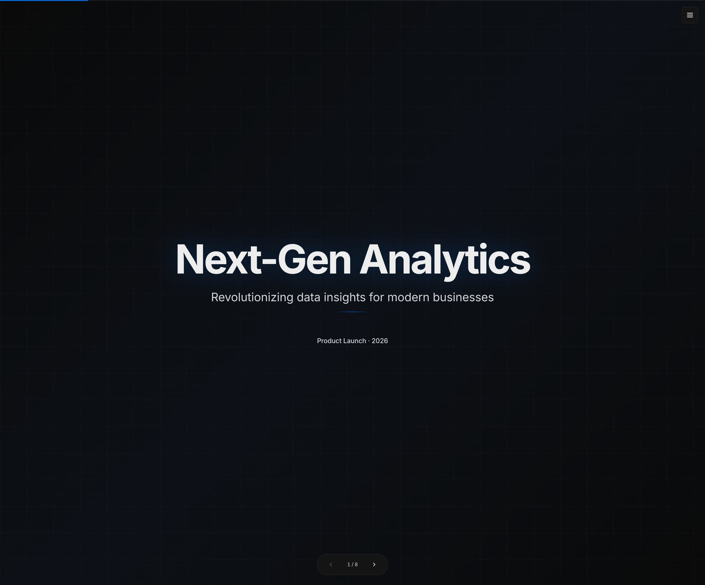 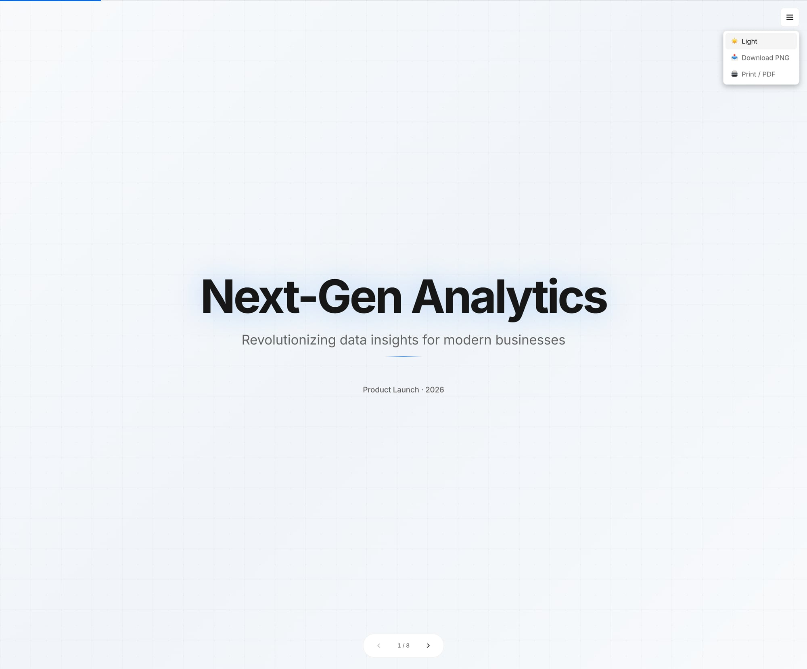

---

### startup-pitch-deck.html
| Dimension | Score | Notes |
|-----------|-------|-------|
| Visual Polish | 8 | Green accent for sustainability brand, clean title slide, professional |
| Theme Quality | 7 | Dark mode has nice green glow; light mode is clean but generic |
| Interactivity | 8 | 11-slide deck with navigation, good slide variety |
| Responsiveness | 7 | Fullscreen slides, fixed format |
| Accessibility | 7 | Navigation accessible, slide content structured |
| Code Quality | 8 | ~520 lines, well-organized multi-slide deck |
| Data Clarity | 8 | Full pitch deck flow: problem → solution → market → team → ask |
| Wow Factor | 7 | Competent pitch deck but doesn't have the "Steve Jobs moment" |
**Average: 7.50**
**Console errors:** none
**Screenshots:** 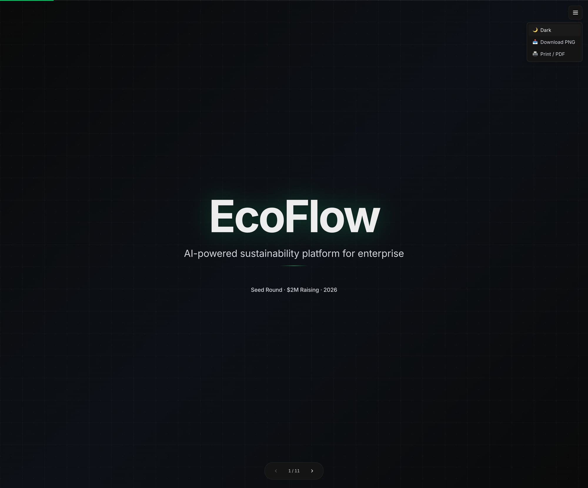 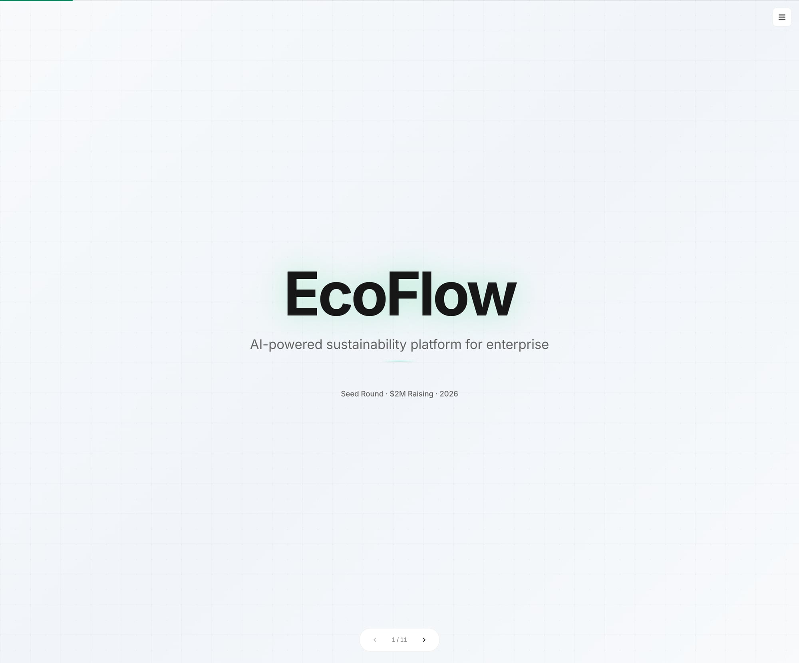

---

### status-report.html
| Dimension | Score | Notes |
|-----------|-------|-------|
| Visual Polish | 9 | Beautiful metric cards with colored tops, progress bars, milestone timeline, risk badges |
| Theme Quality | 9 | Dark mode is stunning — the colored metric cards and progress bars glow. Light mode equally polished |
| Interactivity | 7 | Status badge, progress bars animated on load; checkboxes for next steps |
| Responsiveness | 8 | Grid adapts, progress bars scale |
| Accessibility | 8 | Status badges labeled, milestones with completion states, risk levels labeled |
| Code Quality | 9 | ~498 lines, excellent semantic structure with landmark roles |
| Data Clarity | 9 | Outstanding: KPIs → progress → milestones → risks → action items. Perfect PM report |
| Wow Factor | 9 | This is genuinely impressive — would use this in a real project. The "On Track" badge, colored progress bars, and risk severity system are all premium |
**Average: 8.50**
**Console errors:** none
**Screenshots:** 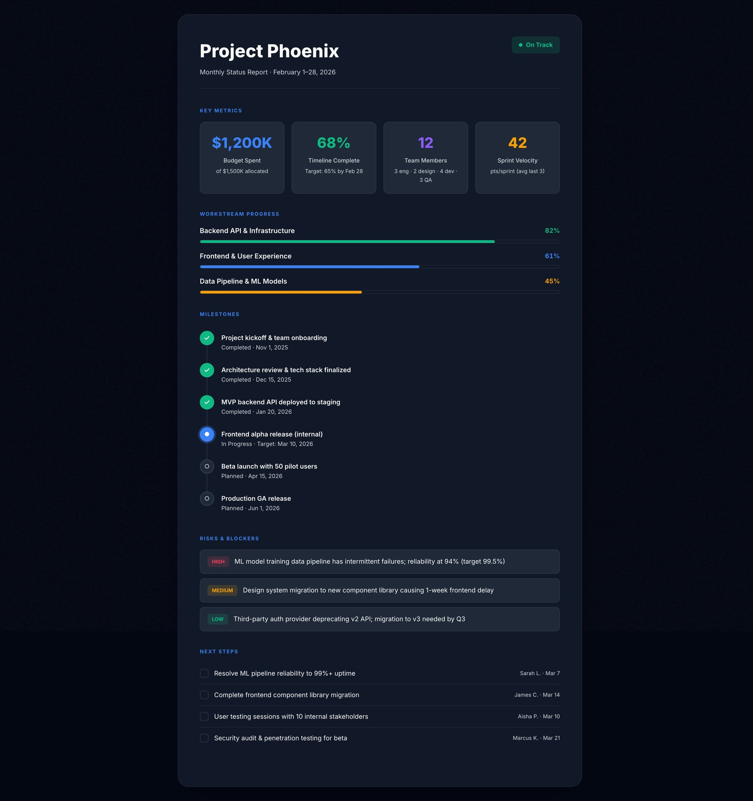 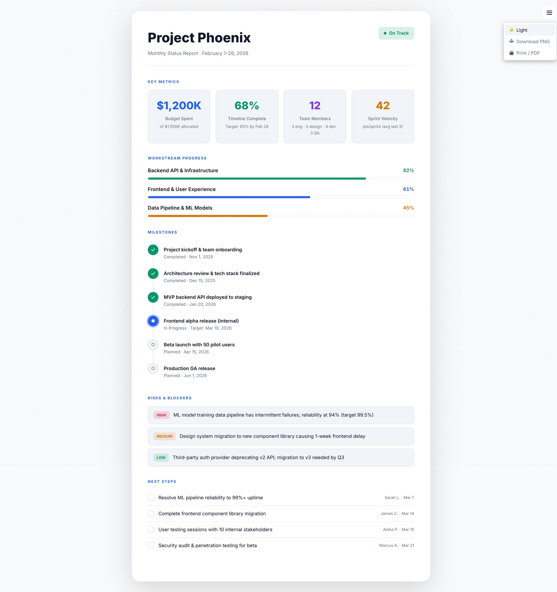

---

### system-architecture.html
| Dimension | Score | Notes |
|-----------|-------|-------|
| Visual Polish | 8 | Layered architecture with flow arrows, tech tags, status indicators |
| Theme Quality | 8 | Both themes handle the complex layout well; dark mode service cards look great |
| Interactivity | 7 | Section navigation, status dots; expandable cards would elevate this |
| Responsiveness | 8 | 3-column grids adapt; architecture layers stack well |
| Accessibility | 7 | Layer navigation, but flow arrows may not convey data flow to screen readers |
| Code Quality | 8 | ~399 lines, well-structured layer system |
| Data Clarity | 9 | Excellent architectural overview: clients → gateway → services → data → external. Tech tags and metrics per service |
| Wow Factor | 8 | The layered architecture with flow arrows and tech tags is exactly what you'd want for a system overview |
**Average: 7.88**
**Console errors:** none
**Screenshots:** 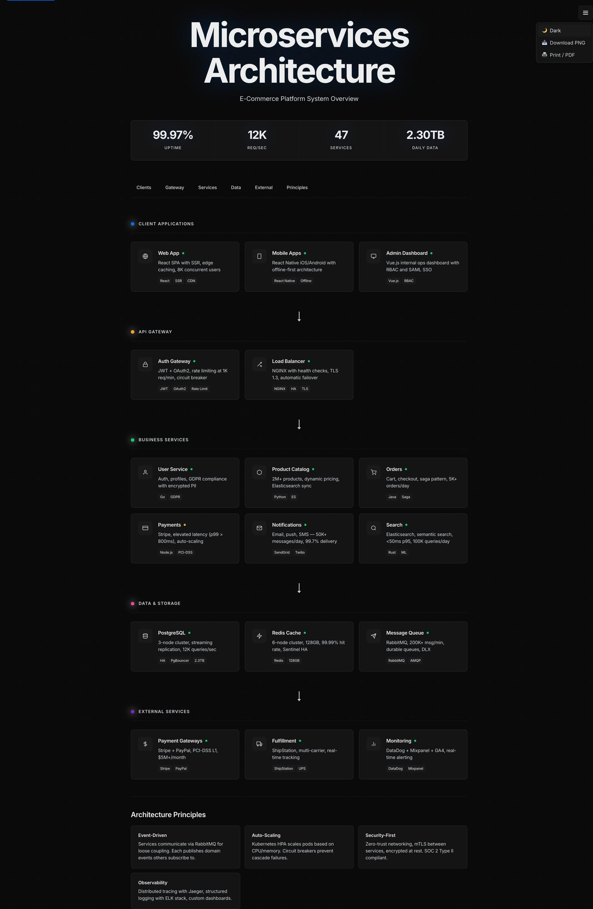 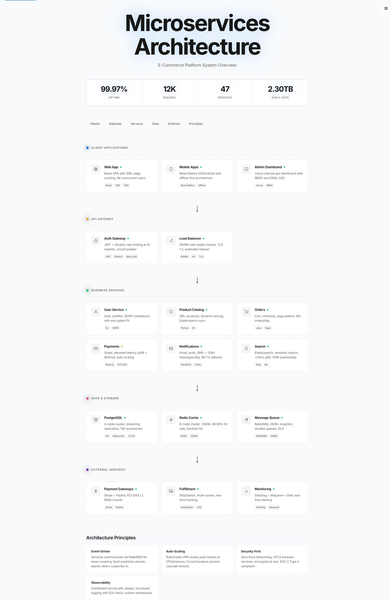

---

## Top 5 Issues (prioritized)

1. **carousel-threads.html theme weakness** — Cards use fixed pastel gradients that don't meaningfully change between themes. The dark/light toggle only affects the background, not the cards themselves. Score: 6 on Theme Quality.

2. **Interactivity gap across static types** — process-guide, quote-card, and cheatsheets score 6 on interactivity. Adding hover effects, subtle entrance animations, or expandable sections would elevate these from "good document" to "premium interactive experience."

3. **Slide decks lose impact in light mode** — slide-deck-demo and startup-pitch-deck are designed dark-first. Light mode feels like an afterthought, lacking the dramatic contrast that makes presentations pop.

4. **Charts lack accessibility** — comparison-infographic and saas-dashboard have impressive CSS-only charts, but data values aren't exposed to screen readers. Need aria-label or sr-only text for chart data points.

5. **Responsiveness ceiling** — All files work at standard widths but none truly leverages ultra-wide screens (>1400px). The fixed max-width approach is safe but misses the opportunity for expanded layouts on large displays.

## Gate Determination
- Overall avg: 7.73
- Highest score: 8.50 (status-report.html)
- Lowest score: 7.13 (carousel-threads.html)
- Lowest dimension: 6 (carousel-threads Theme Quality; multiple files Interactivity)
- Gate: **SHIP**

### Gate Rationale
Average of 7.73 with no file below 7.0 and the strongest files (status-report at 8.50, cheatsheet-claude-code at 8.13) approaching genuinely impressive territory. Zero console errors across all 15 files. Consistent theme support, accessibility foundations (skip links, semantic HTML, ARIA), and clean self-contained code. The main gap is interactivity and polish details that separate "very good" from "viral." This is solidly shippable work.
