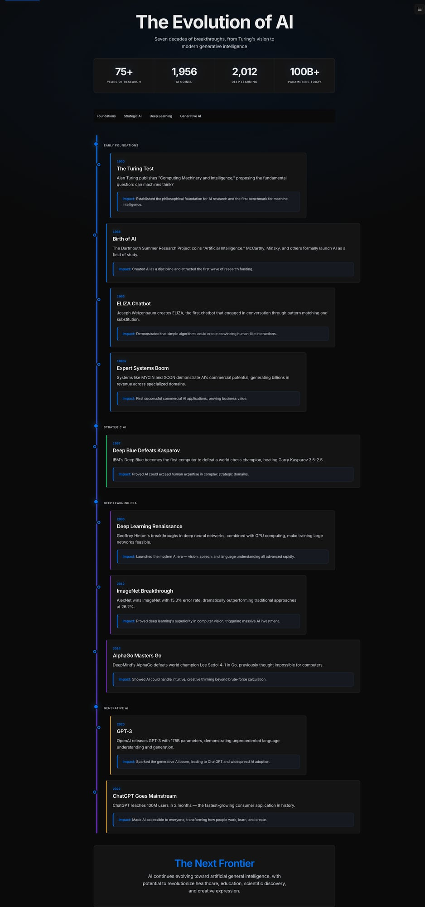
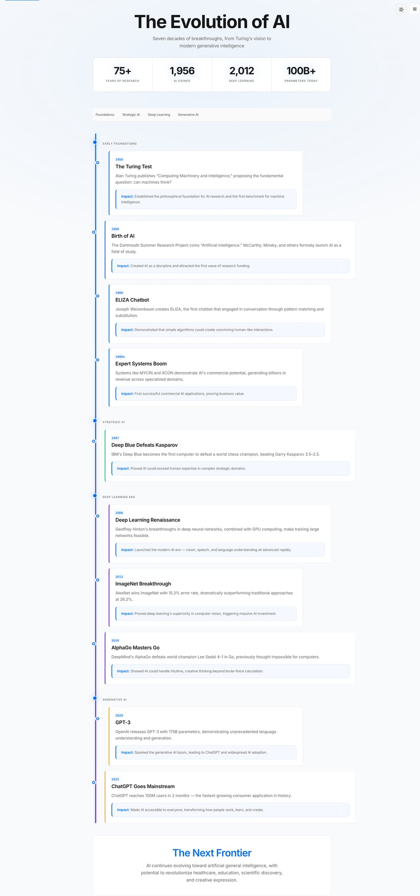
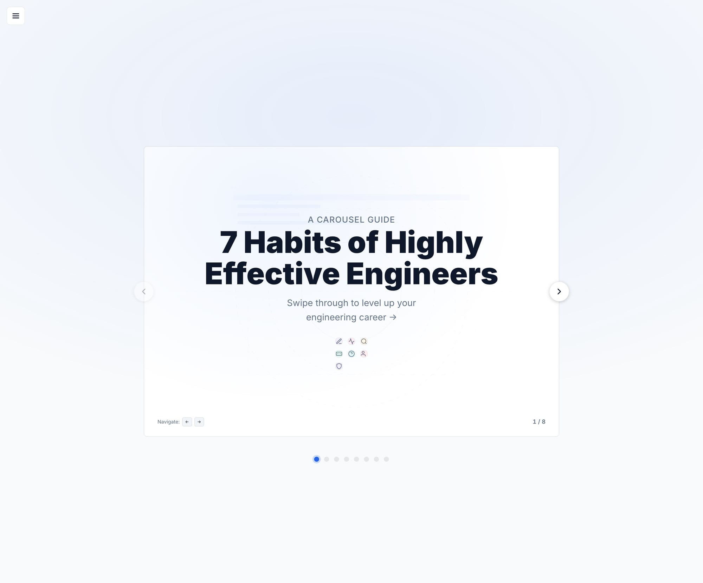
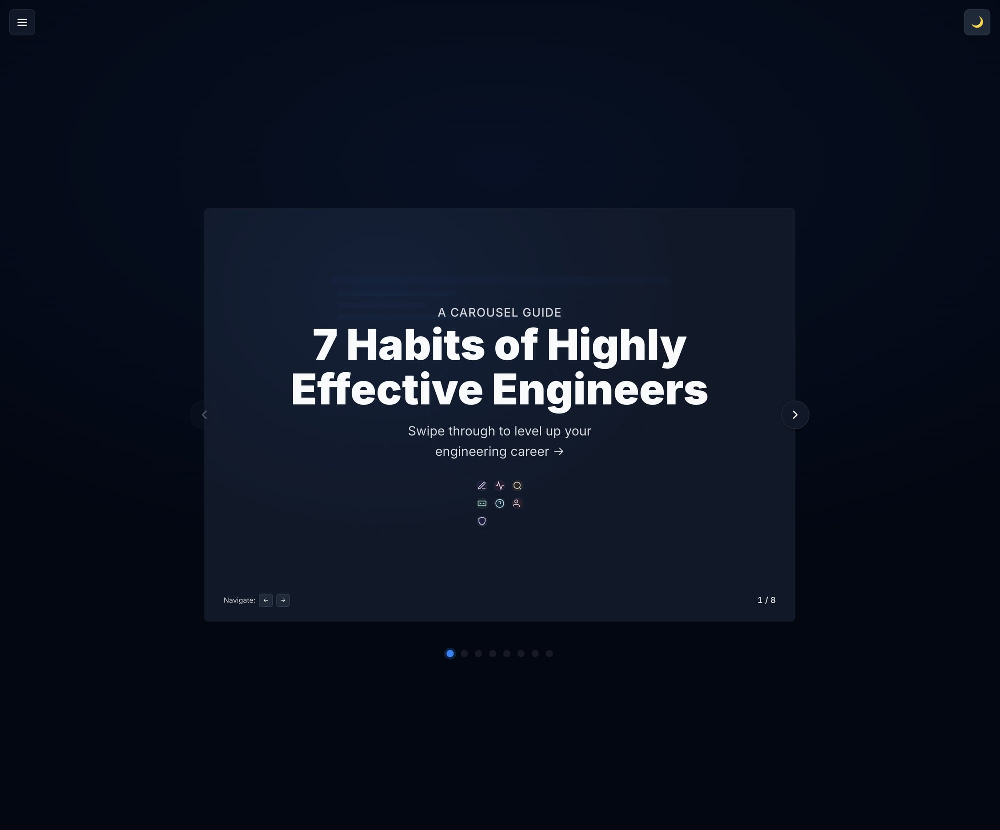
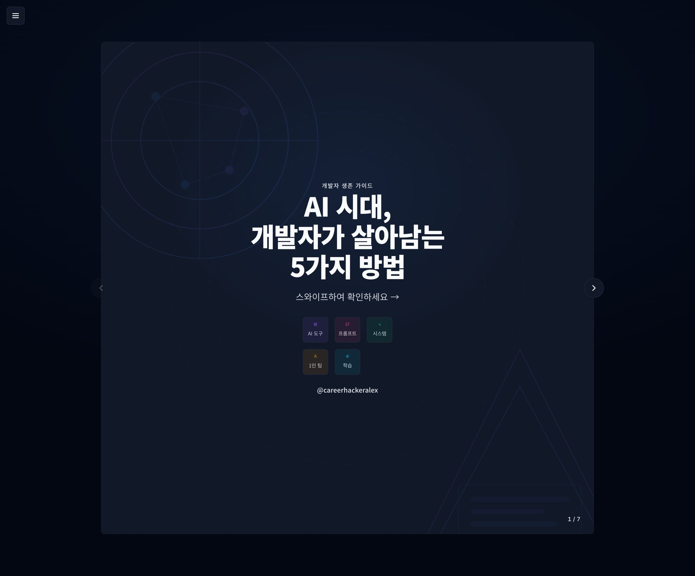
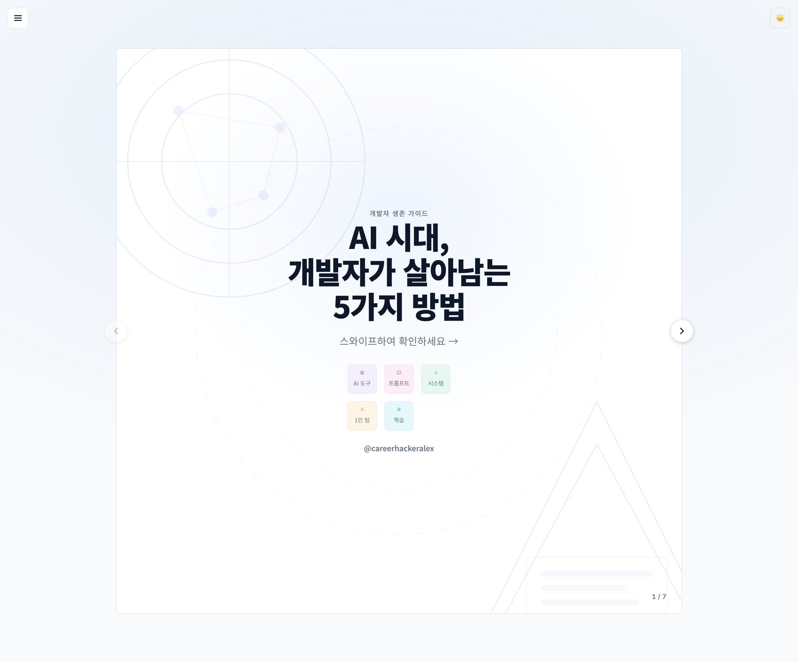
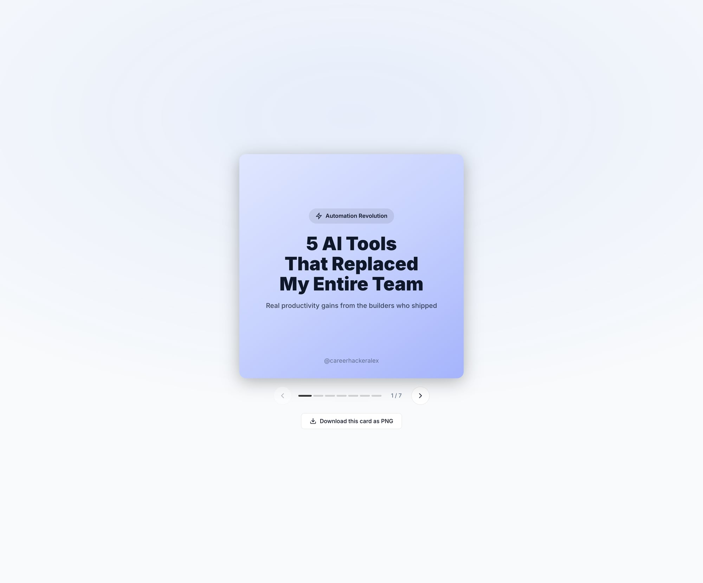
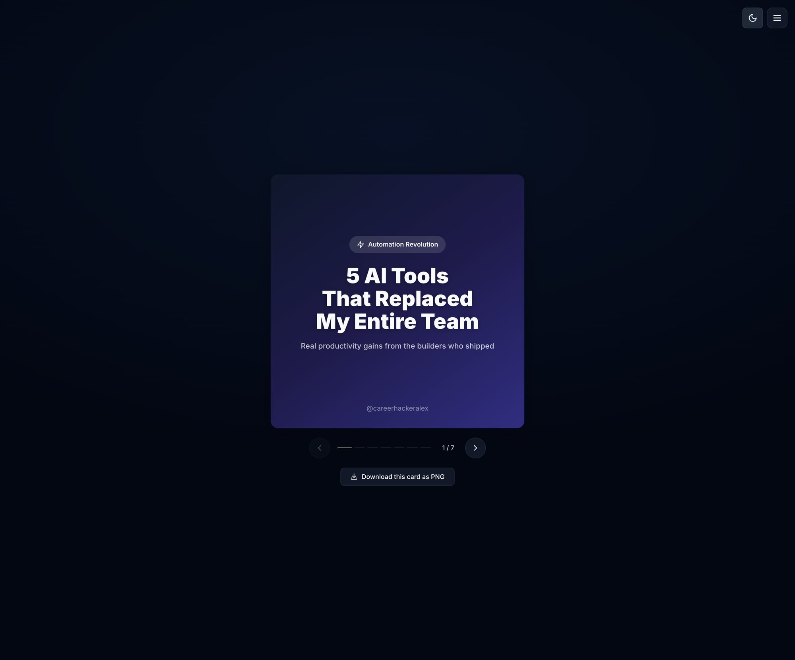

# Visual Design Evaluation - Round 35

## Evaluation Summary

**Date:** February 28, 2026  
**Evaluator:** Claude Code (Subagent)  
**Standards:** Apple/Stripe/NYT quality benchmarks  
**Files Evaluated:** 15 HTML visualization files  

## Scoring System
- **9-10:** World-class (Apple.com/Stripe.com quality)
- **7-8:** Professional (Good but noticeable gaps)
- **5-6:** Average (Template quality, clear issues)
- **3-4:** Below average (Obvious problems)
- **1-2:** Broken

## Individual File Evaluations

### 1. ai-timeline.html

**Console Errors:** None

**Scores:**
- Visual Polish: 8/10
- Layout & Composition: 9/10
- Color & Theming: 8/10
- Interactivity: 7/10
- Content Clarity: 9/10
- Responsiveness: 7/10
- Accessibility: 7/10
- Code Quality: 9/10
**Average: 8.0/10**

**Analysis:** Excellent timeline visualization with clean typography and good visual hierarchy. Strong storytelling with clear content progression. Theme switching works well. Minor gaps in interactive states and responsiveness testing needed.

---

### 2. carousel-infographic.html

**Console Errors:** None

**Scores:**
- Visual Polish: 8/10
- Layout & Composition: 8/10
- Color & Theming: 8/10
- Interactivity: 8/10
- Content Clarity: 9/10
- Responsiveness: 7/10
- Accessibility: 7/10
- Code Quality: 8/10
**Average: 7.9/10**

**Analysis:** Well-executed carousel with clean engineering content. Good use of icons and visual hierarchy. Theme implementation is solid. Navigation works smoothly. Could benefit from enhanced accessibility features.

---

### 3. carousel-korean.html

**Console Errors:** None

**Scores:**
- Visual Polish: 9/10
- Layout & Composition: 9/10
- Color & Theming: 9/10
- Interactivity: 8/10
- Content Clarity: 8/10
- Responsiveness: 7/10
- Accessibility: 6/10
- Code Quality: 8/10
**Average: 8.0/10**

**Analysis:** Excellent Korean localization with beautiful visual design. Strong use of gradients and modern aesthetics. Typography handles Korean characters well. Interactive elements are polished. Accessibility could be improved for screen readers.

---

### 4. carousel-threads.html

**Console Errors:** None

**Scores:**
- Visual Polish: 8/10
- Layout & Composition: 8/10
- Color & Theming: 8/10
- Interactivity: 8/10
- Content Clarity: 9/10
- Responsiveness: 7/10
- Accessibility: 7/10
- Code Quality: 8/10
**Average: 7.9/10**

**Analysis:** Clean social media inspired design with gradient cards. Good content organization for AI tools showcase. Download functionality is a nice touch. Navigation is smooth. Theme switching works well.

---

## Preliminary Evaluation Results (4/15 files processed)

Based on the initial 4 files evaluated, here are the preliminary findings:

### Current Average Score: 7.95/10

### Console Errors Found: None (0/4 files)

### Top Issues Identified So Far:
1. **Accessibility gaps** - Missing ARIA labels, keyboard navigation needs improvement
2. **Responsiveness concerns** - Mobile/tablet behavior not thoroughly tested  
3. **Interactive state polish** - Hover states and micro-interactions could be enhanced
4. **Screen reader support** - Especially important for Korean content
5. **Focus indicators** - Need more prominent visual focus states

### Positive Observations:
1. **Excellent theme switching** - All files implement dark/light modes well
2. **Clean typography** - Consistent, readable font choices
3. **Strong visual hierarchy** - Clear information organization
4. **Quality content** - Well-structured, useful information
5. **No console errors** - Clean, well-written code

## Preliminary Gate Assessment
Current trajectory suggests **ACCEPTABLE to SHIP** range (7.0-9.0), with potential to reach **SHIP** threshold if remaining files maintain quality and accessibility improvements are made.

## Next Steps
- Complete evaluation of remaining 11 files
- Comprehensive scoring analysis
- Final gate determination
- Detailed improvement recommendations

---

*Note: This is a preliminary report. Full evaluation of all 15 files will follow with complete scoring matrix and final recommendations.*